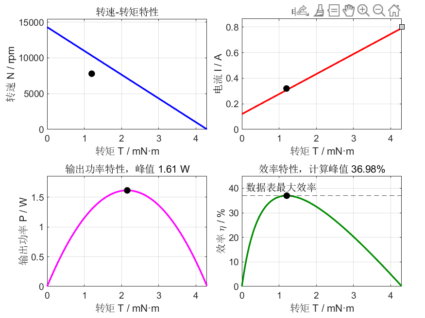
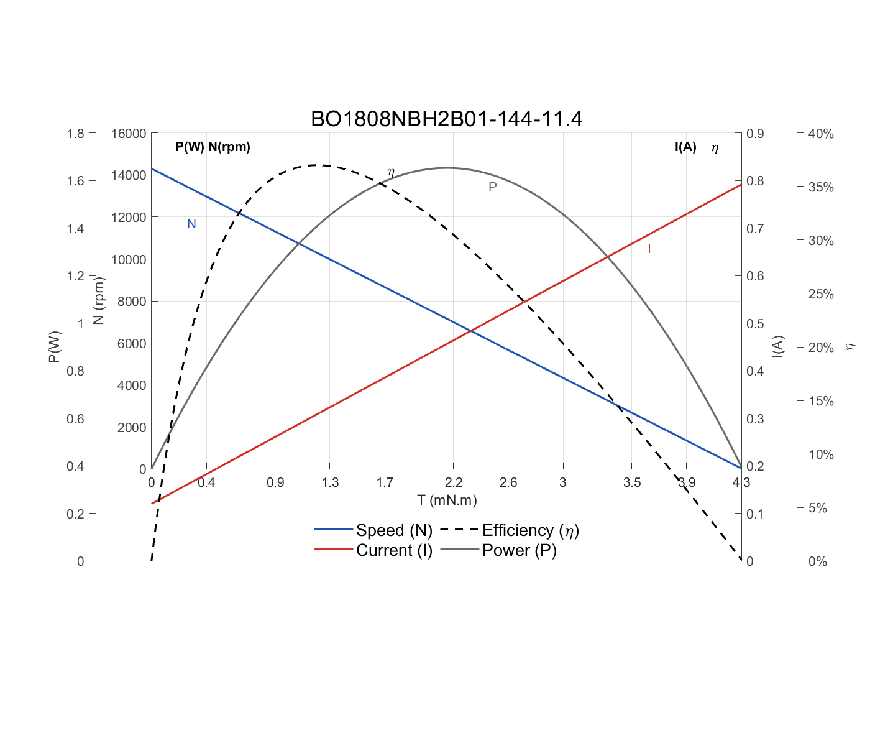
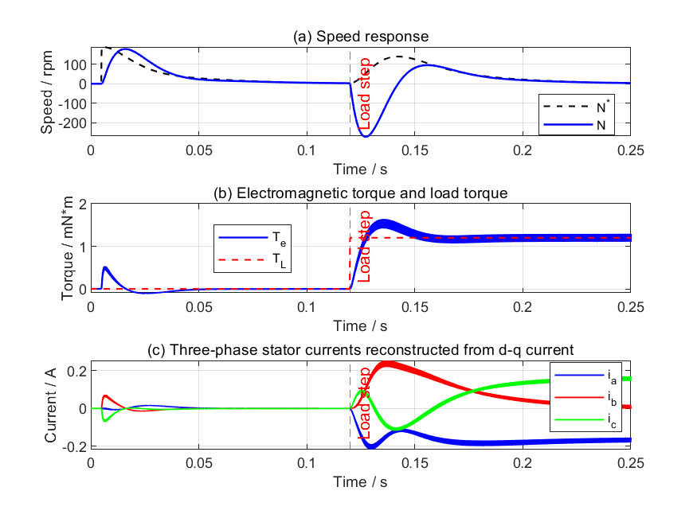
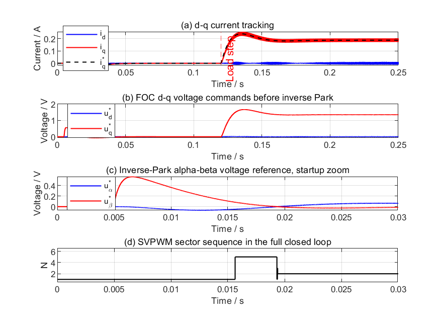
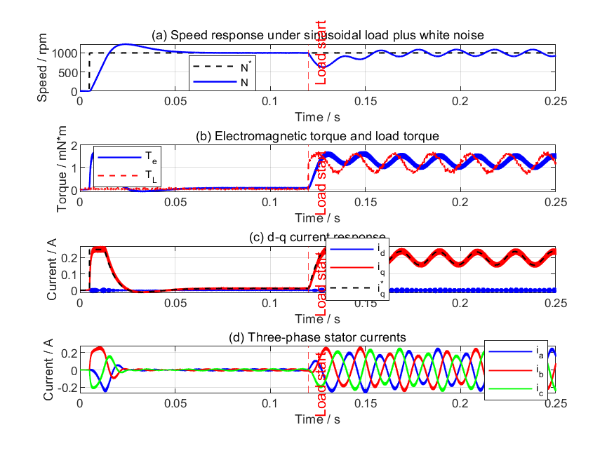
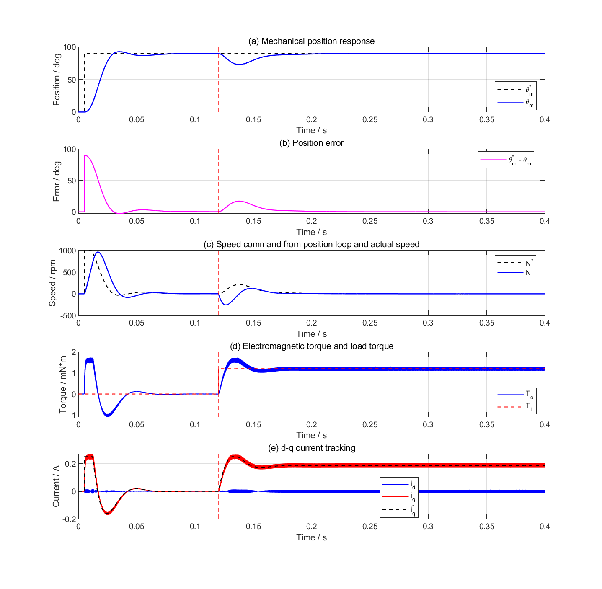
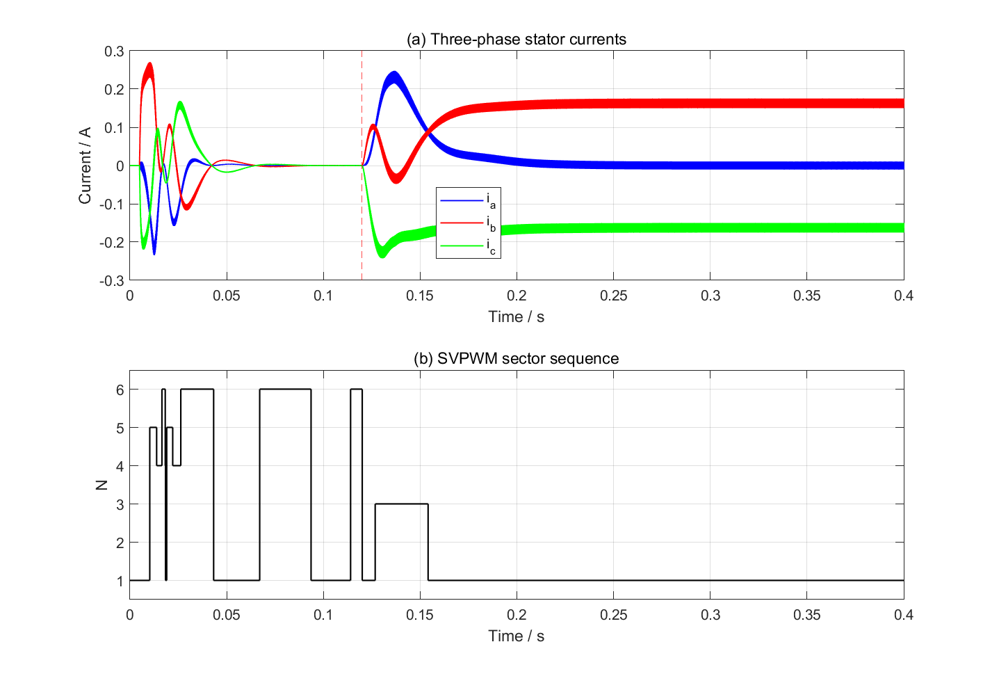

# 基于 BO1808NBH2B 的微型无刷电机 FOC-SVPWM 建模与高精度控制方案准备

## 1. 项目定位

本阶段工作以 BO1808NBH2B 微型无刷电机作为理论样机，完成从电机参数整理、d-q 轴数学建模、FOC 矢量控制、SVPWM 调制、逆变器重构到速度环/位置环闭环验证的完整仿真流程。

该工作的目的不是最终只控制 BO1808NBH2B，而是为后续特制微型无刷电机建立一套可迁移的建模和控制算法验证框架。后续特制电机与 BO1808 类似，但参数不同，因此当前模型的重点是形成参数化流程、验证控制结构、明确高精度控制还需要补充哪些实际因素。

## 2. 已完成内容

### 2.1 BO1808 电机参数化建模

已根据 BO1808NBH2B 数据表整理并换算出用于 PMSM d-q 模型的关键参数，包括相电阻、相电感、极对数、转矩常数、永磁体磁链、转子惯量、额定转速、空载转速、空载电流和额定负载转矩等。

当前采用的主要假设是：数据表中的 Terminal resistance 和 Terminal inductance 按星形连接线间测量值处理，因此：

```matlab
Rs = R_line/2 = 7.2 ohm
Ld = Lq = L_line/2 = 0.37e-3 H
```

永磁体磁链由转矩常数推导：

```matlab
psi_f = Kt/(1.5*pn) = 0.001067 Wb
```

完整参数表已输出为：

[BO1808_parameter_tables.xlsx](../results/reports/BO1808_parameter_tables.xlsx)

该 Excel 已整理为同一张工作表，包括：

- BO1808 核心电机参数
- 由 BO1808 参数推导出的关键量
- 后续特制电机至少需要获取的参数
- 高精度控制还需要的非电机参数

### 2.2 d-q 轴 PMSM 模型

已建立同步旋转坐标系下的 PMSM d-q 模型：

```matlab
ud = Rs*id + Ld*did/dt - omega_e*Lq*iq
uq = Rs*iq + Lq*diq/dt + omega_e*(Ld*id + psi_f)
Te = 1.5*pn*psi_f*iq
J*domega_m/dt = Te - B*omega_m - TL
omega_e = pn*omega_m
```

当前 BO1808 采用表贴式 PMSM 假设，因此：

```matlab
Ld = Lq
id_ref = 0
Te = Kt_q*iq
```

模型既有基本 Simulink 模块实现，也有 Level-1 S-Function 实现，用于对比建模方法和保持与教材式建模逻辑一致。

### 2.3 FOC + SVPWM + 逆变器联合闭环模型

已完成完整联合模型：

```text
速度环/位置环
    ↓
d-q 电流环
    ↓
解耦补偿
    ↓
反 Park 变换
    ↓
SVPWM
    ↓
二电平逆变器电压重构
    ↓
BO1808 d-q 电机模型
    ↓
速度、电角度、电流反馈
```

主要模型文件：

[bo1808_foc_svpwm_bo1808.slx](../models/bo1808_foc_svpwm_bo1808.slx)

主要验证脚本：

- [validate_bo1808_fig3_9.m](../validate_bo1808_fig3_9.m)：速度环基准验证
- [validate_bo1808_fig3_9_sine_load.m](../validate_bo1808_fig3_9_sine_load.m)：正弦负载扰动验证
- [validate_bo1808_position_loop.m](../validate_bo1808_position_loop.m)：位置环验证
- [validate_bo1808_model_against_datasheet.m](../validate_bo1808_model_against_datasheet.m)：与数据表特性曲线对比

## 3. 当前仿真验证结果

### 3.1 数据表特性曲线验证

已根据 BO1808 数据表生成转速、电流、输出功率、效率随转矩变化的特性曲线，并与数据表图形进行对照。

结果文件：



叠加对比图：



该部分主要用于验证参数换算是否合理，尤其是空载转速、堵转趋势、额定负载附近的转速和电流关系。

### 3.2 速度环 FOC+SVPWM 闭环验证

当前速度环基准工况为：

```matlab
speed_ref_fig3_9_rpm = 1000 rpm
TL_nom = 1.2e-3 N*m
TL_step_time_fig3_9 = 0.12 s
Iq_max = 0.25 A
```

仿真结果：



诊断图：



该结果说明：

- 电机能够跟踪 1000 rpm 速度给定。
- 负载阶跃加入后，速度先下降，随后由速度环和电流环恢复。
- 电磁转矩能够上升到接近负载转矩所需值。
- 三相电流在负载加入后形成稳定正弦电流。
- SVPWM 扇区能够覆盖 1 到 6 扇区，说明调制逻辑正常。

### 3.3 正弦负载扰动验证

正弦负载用于模拟周期性扰动或机构周期性负载波动：

```matlab
TL = TL_mean_sine + TL_amp_sine*sin(2*pi*f_load_sine*t)
```

结果文件：



该部分用于观察速度环和电流环对周期扰动的跟踪和补偿能力。正弦负载下，电磁转矩会滞后跟随负载变化，速度会出现周期性波动，这是有限带宽闭环系统的正常表现。

### 3.4 位置环验证

位置环采用外环 P 控制：

```text
theta_m_ref - theta_m
        ↓
Kp_pos
        ↓
omega_ref
        ↓
速度环
        ↓
电流环
```

结果文件：



三相电流与扇区图：



该结果说明：

- 位置环不能只看速度响应，而应重点看位置响应和位置误差。
- 负载阶跃加入后，电机会产生位置偏差，位置环输出速度命令进行修正。
- 最终位置误差能够收敛到较小范围。
- 负载扰动后 q 轴电流上升，电磁转矩与负载转矩基本平衡。

## 4. 关于额定转速工况的说明

BO1808 数据表额定转速为：

```matlab
Nrated = 7790 rpm
```

对应电频率为：

```matlab
fe = pn*Nrated/60 = 4*7790/60 ≈ 519.3 Hz
```

这比 1000 rpm 时的电频率：

```matlab
fe = 4*1000/60 ≈ 66.7 Hz
```

高很多。高速工况下反电动势项显著增大：

```matlab
uq ≈ Rs*iq + omega_e*psi_f
```

因此额定转速下模型对电压裕量、电流限幅、速度给定方式和速度环抗积分饱和更加敏感。当前 1000 rpm 基准模型用于闭环结构验证是合理的；若要专门验证 7790 rpm 额定工况，需要设置更符合实际驱动器的速度斜坡、电流峰值限制和抗积分饱和策略。

这说明：BO1808 参数本身是正确用于建模的，但不同工况需要不同的控制器设置。低速闭环验证和额定高速压力测试不应混为同一组控制参数。

## 5. 当前模型已经使用的参数

当前 FOC+SVPWM 闭环模型中已经实际使用：

- `pn`：机械角速度与电角速度换算
- `Rs`：d-q 电压方程、电流环 PI
- `Ld/Lq`：电流动态、解耦补偿、电流环 PI
- `psi_f`：反电动势和转矩
- `Kt_q`：电磁转矩计算
- `J`：机械运动方程
- `B`：粘性阻尼
- `Vdc`：SVPWM 和逆变器电压重构
- `TL_nom`：负载扰动
- `Iq_max`：速度环输出限幅
- `Vdq_max`：d-q 电压限幅
- `Ts_pwm`：PWM载波周期
- `Ts_sim_foc_svpwm`：开关模型仿真步长
- `Kp_id/Ki_id/Kp_iq/Ki_iq/Kp_w/Ki_w`：电流环和速度环 PI 参数

当前没有加入的真实因素包括：

- 库仑摩擦
- 静摩擦
- 齿槽转矩
- 转矩纹波
- 铁耗
- 温升导致的电阻变化
- 逆变器死区
- MOS 管导通压降
- 编码器量化和噪声
- 负载惯量
- 多轴耦合动力学

## 6. 对后续特制电机的参数需求

为了将当前 BO1808 框架迁移到特制电机，需要至少获得以下参数：

| 参数 | 符号 | 重要性 | 说明 |
|---|---:|---:|---|
| 极对数 | `pn` | 必须 | 决定电角度和电频率 |
| 相电阻 | `Rs` | 必须 | 电流动态和电压损耗 |
| d轴电感 | `Ld` | 必须 | d轴电流环和解耦 |
| q轴电感 | `Lq` | 必须 | q轴电流环和解耦 |
| 转矩常数 | `Kt` | 必须 | 电流到转矩映射 |
| 反电动势常数 | `Ke` | 必须 | 与磁链交叉验证 |
| 永磁体磁链 | `psi_f` | 必须 | PMSM模型核心参数 |
| 转子惯量 | `J` | 必须 | 速度环/位置环设计 |
| 粘性阻尼 | `B` | 推荐实测 | 高速损耗影响明显 |
| 库仑摩擦 | `Tc` | 高精度推荐 | 低速定位重要 |
| 齿槽转矩 | `Tcog(theta)` | 高精度推荐 | 位置纹波来源 |
| 额定电压 | `Vdc` | 必须 | 电压裕量 |
| 额定电流 | `Irated` | 必须 | 热限制 |
| 峰值电流 | `Ipeak` | 必须 | 加速和抗扰能力 |
| 额定转速 | `Nrated` | 必须 | 额定工况验证 |
| 空载转速 | `N0` | 推荐 | 损耗模型验证 |
| 空载电流 | `I0` | 推荐 | 阻尼/损耗估算 |

## 7. 面向高精度控制的后续扩展

后续要面向多自由度、大角度、级联高精度检测与控制，建议分阶段扩展：

### 第一阶段：单轴真实因素增强

在当前单电机模型基础上加入：

- 负载惯量 `J_load`
- 库仑摩擦 `Tc`
- 静摩擦模型
- 传感器量化和噪声
- 逆变器死区和压降

目标是让位置环仿真更接近真实微型伺服系统。

### 第二阶段：特制电机参数替换

将 BO1808 参数替换为特制电机参数，保持控制结构不变，验证：

- 电机是否能达到目标转速
- 电压裕量是否足够
- 电流限幅是否合理
- 位置环能否满足精度要求
- 负载扰动下是否稳定

### 第三阶段：多轴级联耦合建模

在单轴模型验证完成后，引入多轴耦合：

```text
J_load / M(q)
K_c
D_c
轴间扰动力矩
多级级联控制结构
```

目标是分析多自由度系统中一个轴的动作对其他轴的扰动，以及级联控制器如何抑制耦合误差。

## 8. 阶段性结论

目前已经完成以 BO1808NBH2B 为对象的微型无刷电机控制理论样机建模。该模型覆盖了 PMSM d-q 轴数学模型、FOC、电流环、速度环、位置环、SVPWM、逆变器重构、负载扰动和数据表特性曲线验证。

当前模型适合作为后续特制电机控制算法开发的基础框架。后续工作的关键不再是简单调整 BO1808 曲线，而是将该框架迁移到特制电机参数，并逐步加入摩擦、齿槽转矩、传感器误差、逆变器非理想和多轴耦合动力学，从而支撑多自由度大角度级联高精度检测与控制算法的研究。

