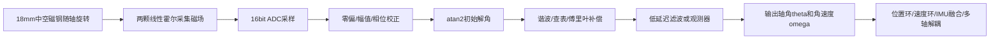
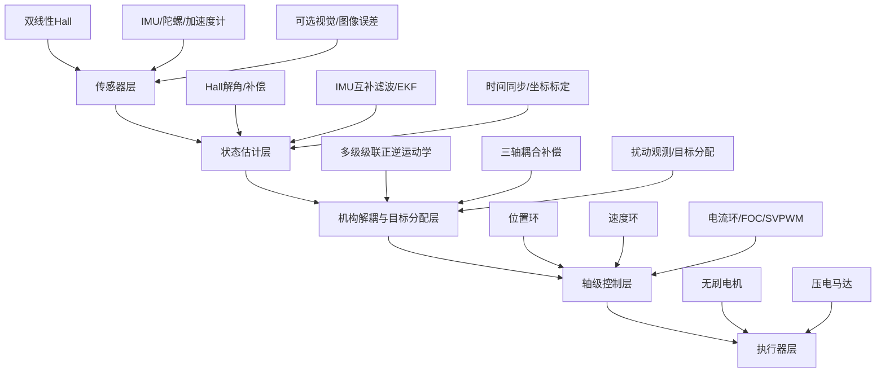

# 双线性霍尔位置检测方案规划与学习路线

## 1. 你这部分工作的定位

你负责的不是单纯“选一个霍尔传感器”，而是设计一套面向特制云台电机的低成本角度检测单元：

```text
两颗线性霍尔 + 磁钢/磁环 + 结构布置 + 标定补偿算法 + 与 IMU/控制器融合接口
```

它的工程角色可以理解为一个“自制磁编码器”。线性霍尔本身不是编码器，但两路近似正交的 Hall 电压经过 `atan2`、误差补偿和滤波后，可以输出云台轴角度和角速度，功能上承担编码器的作用。

在整个云台系统中，它主要服务于以下环节：

| 环节 | 双线性霍尔的作用 |
|---|---|
| 电机/关节角度检测 | 测量每个云台轴或电机轴的相对转角 |
| 位置环 | 提供当前轴角度反馈 |
| 速度环 | 由角度差分或观测器得到轴角速度 |
| FOC/电机控制 | 必要时提供转子电角度或辅助换相角度 |
| IMU 融合 | 与陀螺/加速度计互补，获得低漂移、高带宽姿态估计 |
| 多轴耦合控制 | 提供各级关节实际角度，用于级联机构解耦与坐标变换 |

一句话总结：**双线性霍尔负责“轴在哪里”，IMU 负责“云台/相机姿态怎么动”，后面的控制模块负责“如何让它动到目标位置并抵抗扰动”。**

## 2. 项目已知约束与设计边界

根据 `手持相机云台相关资料_图片信息提取.md` 中图片 11-12 的信息，本项目传感器方案已经有一组比较明确的工程边界，后续双线性霍尔方案应围绕这些条件展开，而不是按通用编码器方案发散。

| 项目 | 已知信息 | 对双线性霍尔方案的影响 |
|---|---|---|
| 机构形式 | 3 级级联系统，3 级间存在耦合，需要解耦 | Hall 不只是单轴反馈，还要给多级机构解耦提供各级关节角 |
| 第一级角度范围 | 约 -235° 到 58° | 第一级是大角度轴，Hall 解角必须支持大范围连续角度展开 |
| 第二级角度范围 | 约 -45° 到 45° | 第二级为中等摆角，可重点关注小角度线性度、滞后和重复性 |
| 第三级角度范围 | 约 -120° 到 70° | 第三级也属于大角度摆动，需要考虑跨象限 `atan2` 和边界连续性 |
| 磁钢信息 | 18 mm 中空磁钢 | 磁路和 PCB 布局应优先围绕中空磁钢布置，不建议临时外加大体积编码器 |
| 极数信息 | 6x12 极 | Hall 信号可能存在多周期映射，需要明确机械角、电角度和磁场周期数关系 |
| ADC 条件 | 16 bit ADC | 具备较高采样分辨率，方案重点转向噪声、安装误差和磁场非理想补偿 |
| Hall 数量 | 检测性能依赖 2 个线性 Hall 器件 | 每轴固定按双 Hall 方案设计，不配置第三路冗余 |
| 负载 | 约 20-30 g | 需要验证负载扰动下角度反馈稳定性，尤其是低速、大角度、冲击工况 |
| 绝对位置/姿态基准 | IMU | IMU 是全局姿态基准，Hall 是各级关节相对角反馈，两者必须融合 |

因此，本规划后续默认采用如下系统假设：

```text
每级旋转轴：18 mm 中空磁钢 + 2 个线性 Hall + 16 bit ADC
检测输出：该级关节相对角 theta_i、角速度 omega_i、信号可信度 valid_i
全局基准：IMU 提供相机/云台姿态基准
控制对象：20-30 g 负载下的三级大角度级联云台
```


## 3. 总体技术路线

推荐采用“两霍尔正余弦解角 + 离线标定 + 在线补偿 + IMU 融合”的路线。



两路 Hall 的理想输出为：

$$
H_s = A_s \sin(\theta) + o_s
$$

$$
H_c = A_c \cos(\theta) + o_c
$$

经过零偏、幅值和相位修正后：

$$
\theta_{\mathrm{raw}}=\operatorname{atan2}(\tilde H_s,\tilde H_c)
$$

实际系统中会有安装偏心、气隙变化、磁钢不均匀、高次谐波和 ADC 噪声，因此需要补偿：

$$
\hat{\theta}
=
\theta_{\mathrm{raw}}
-
\hat e(\theta_{\mathrm{raw}})
$$

其中 `e(theta)` 可以由查表、傅里叶级数或低阶多项式描述。

如果磁钢为多极结构，则 Hall 输出的磁场周期可能不是一圈一个周期，需要建立机械角和磁场角之间的关系：

$$
\theta_{\mathrm{mag}} = n_m \theta_{\mathrm{mech}} + \theta_0
$$

其中 `n_m` 为磁场周期数，`theta_0` 为安装零位偏移。工程实现时需要通过标定确认 `n_m` 和零位，否则会出现角度周期混淆。

## 4. 具体规划方案

### 4.1 第一阶段：需求和指标确认

目标是把甲方要求转成传感器方案可执行的指标。

需要明确：

| 项目 | 建议确认内容 |
|---|---|
| 检测对象 | 优先定义为各级云台关节相对角；若兼作 FOC，则需额外输出电角度 |
| 角度范围 | 第一级约 -235° 到 58°，第二级约 -45° 到 45°，第三级约 -120° 到 70° |
| 目标精度 | 静态精度、重复精度、动态跟随误差 |
| 采样率 | Hall 采用 16 bit ADC，需进一步确认采样率、IMU 采样率和控制周期 |
| 延迟 | 位置反馈允许的最大延迟 |
| 体积成本 | 每轴只用两颗线性 Hall，不增加第三路冗余 |
| 机械约束 | 围绕 18 mm 中空磁钢进行 Hall 与 PCB 布局 |
| 负载工况 | 20-30 g 负载，覆盖低速、大角度、冲击扰动和多轴耦合 |
| 绝对基准 | IMU 是最终姿态/绝对位置基准，Hall 是各级关节相对位置反馈 |

这一阶段的输出：

- 双霍尔角度检测需求表；
- 每轴角度范围和精度目标；
- Hall、IMU、控制器采样率初步设定；
- 传感器与控制模块接口定义初稿。

### 4.2 第二阶段：磁路与结构方案设计

这一阶段决定原始 Hall 信号质量，是后面算法能否补偿好的基础。

重点设计内容：

| 设计对象 | 设计要点 |
|---|---|
| 18 mm 中空磁钢 | 优先复用项目已给定磁钢条件，保证旋转时磁场具有稳定周期性 |
| 6x12 极结构 | 明确机械角、电角度、磁场周期数的换算关系，避免多周期解角混淆 |
| 两颗 Hall 位置 | 目标相差 90° 磁场相位，形成正余弦信号 |
| 气隙 | 尽量稳定，避免机械偏心导致幅值波动 |
| PCB 布局 | 两颗 Hall 到磁钢距离一致，走线短，降低噪声 |
| 安装基准 | Hall、磁钢、轴承、电机定转子要有清晰定位基准 |

推荐先做三种方案对比：

| 方案 | 特点 | 适用性 |
|---|---|---|
| 轴端径向磁钢 + 双 Hall | 结构简单，适合小型电机轴端检测 | 可用于早期原理验证 |
| 18 mm 中空磁钢 + 双 Hall | 贴合项目已有磁钢条件，适合中空结构和大角度关节 | 优先考虑 |
| 电机内部磁场复用 | 体积最省，但磁场畸变更复杂 | 可作为后续优化 |

这一阶段的输出：

- 双 Hall 安装示意图；
- 18 mm 中空磁钢、双 Hall、PCB 的初步结构尺寸；
- 可能的磁场仿真或简单实验验证；
- 原始 Hall 波形质量判断：幅值、相位差、噪声、饱和情况。

### 4.3 第三阶段：信号采集与基础解角

目标是先把两路模拟电压稳定转成角度。

基本处理链路：

```text
Hall ADC 原始值
-> 零偏校正
-> 幅值归一化
-> 相位正交化
-> atan2 解角
-> unwrap 连续化
-> 角速度估计
```

需要实现的基础公式：

$$
\tilde H_s=\frac{H_s-o_s}{A_s}
$$

$$
\tilde H_c=\frac{H_c-o_c}{A_c}
$$

若两路相位不是严格 90°，可做正交化：

$$
H_c^{\prime}
=
\frac{\tilde H_c-\sin(\Delta\phi)\tilde H_s}{\cos(\Delta\phi)}
$$

解角：

$$
\theta_{\mathrm{raw}}
=
\operatorname{atan2}(\tilde H_s,H_c^{\prime})
$$

角速度估计：

$$
\omega
=
\frac{\theta(k)-\theta(k-1)}{T_s}
$$

这一阶段的输出：

- MATLAB/Python 离线解角脚本；
- 两路 Hall 原始波形图；
- `atan2` 前后的角度曲线；
- 初始角度误差曲线；
- 机械角、磁场角、电角度之间的换算关系；
- 可用于后续控制器的角度数据接口。

### 4.4 第四阶段：误差补偿与标定

两颗 Hall 成本低，但必须依靠标定补偿提高精度。

推荐补偿顺序：

1. 零偏补偿；
2. 幅值补偿；
3. 相位误差补偿；
4. 谐波误差补偿；
5. 查表或傅里叶周期误差补偿；
6. 温漂和长期漂移补偿。

周期误差可写成：

$$
e(\theta)=a_0+\sum_{n=1}^{N}
\left[
a_n\cos(n\theta)+b_n\sin(n\theta)
\right]
$$

补偿后角度：

$$
\hat{\theta}
=
\theta_{\mathrm{raw}}
-
\hat e(\theta_{\mathrm{raw}})
$$

推荐标定流程：


参考角度来源可以分阶段选择：

| 阶段 | 参考来源 |
|---|---|
| 早期实验 | 高精度旋转台、商用编码器、视觉测角 |
| 样机调试 | IMU 姿态 + 低速稳定运动数据 |
| 批量标定 | 工装限位点 + 标定轨迹 + 数据拟合 |

这一阶段的输出：

- 标定参数表；
- 每级轴、每台电机独立补偿参数；
- 补偿前后误差对比图；
- 误差 RMS、峰峰值、滞后误差、重复性指标。

### 4.5 第五阶段：与 IMU 融合

双 Hall 适合低漂移轴角度，IMU 适合高频角速度和姿态扰动，两者互补。

推荐融合思路：

```text
Hall：低频可靠、无长期积分漂移、反映关节实际位置
Gyro：高频响应快、适合手抖和冲击，但会积分漂移
Accel：低频重力参考，但动态加速度下不可靠
```

简化互补滤波形式：

$$
\hat{\theta}(k)
=
\alpha
\left[
\hat{\theta}(k-1)+\omega_{\mathrm{gyro}}T_s
\right]
+
(1-\alpha)\theta_{\mathrm{Hall}}(k)
$$

在强扰动或冲击下，应降低加速度计权重，避免把线加速度误认为姿态变化。

这一阶段的输出：

- Hall-IMU 时间同步方案；
- Hall 角度与陀螺角速度融合算法；
- 静态、低速、大角度、冲击扰动下的融合效果图；
- 面向三级级联系统的统一状态量：各级关节角、关节角速度、IMU 姿态、IMU 角速度。

### 4.6 第六阶段：接入控制系统

你这部分最后要交付给后面的控制模块一个“干净、稳定、低延迟”的状态估计接口。

建议输出信号：

| 信号 | 含义 | 给谁用 |
|---|---|---|
| `theta_axis` | 当前轴角度 | 位置环、机构解耦 |
| `omega_axis` | 当前轴角速度 | 速度环、扰动观测 |
| `theta_e` | 电角度，可选 | FOC/Park 变换 |
| `theta_mag` | 磁场角，可选 | 多极磁场解角与标定 |
| `valid_flag` | Hall 信号是否可信 | 安全保护 |
| `error_metric` | 幅值/相位/残差异常指标 | 故障诊断 |
| `timestamp` | 采样时间戳 | 多传感器同步 |

对三级级联云台，建议统一命名为：

```text
theta_1, omega_1：第一级，约 -235° 到 58°
theta_2, omega_2：第二级，约 -45° 到 45°
theta_3, omega_3：第三级，约 -120° 到 70°
q_imu, gyro_imu：IMU 输出的姿态四元数和角速度
```

## 5. 学习路线

### 5.1 第一层：先搞懂线性霍尔如何变成角度

学习目标：

- 线性霍尔测的是磁场，不是直接测角度；
- 两路正交 Hall 信号可以通过 `atan2` 得到角度；
- 零偏、幅值、相位误差会直接造成角度误差。

建议学习内容：

1. 线性 Hall 输出原理；
2. 正弦/余弦编码器原理；
3. `atan2` 解角；
4. 电角度和机械角度关系；
5. ADC 分辨率、噪声、采样率对角度精度的影响。

推荐动手任务：

- 用 MATLAB 生成两路理想正余弦信号；
- 人为加入零偏、幅值不一致、相位误差；
- 观察 `atan2` 角度误差如何变化；
- 写一个基础补偿脚本。

### 5.2 第二层：学习误差建模和补偿

学习目标：

- 知道 Hall 误差不是随机乱跳，而是大量表现为角度相关的周期误差；
- 会用查表或傅里叶模型补偿误差。

建议学习内容：

1. 傅里叶级数；
2. 谐波误差；
3. 查表补偿；
4. 标定曲线拟合；
5. 补偿前后误差评价指标。

推荐动手任务：

- 对模拟 Hall 信号加入 3、5、7 次谐波；
- 对角度误差做 FFT；
- 用傅里叶项拟合误差；
- 输出补偿前后误差图。

### 5.3 第三层：学习 IMU 与 Hall 融合

学习目标：

- Hall 解决低漂移位置问题；
- 陀螺解决高频动态问题；
- 加速度计在冲击下不能盲目信任。

建议学习内容：

1. 陀螺积分；
2. 加速度计姿态修正；
3. 互补滤波；
4. 扩展卡尔曼滤波基本思想；
5. 时间同步和坐标系标定。

推荐动手任务：

- 用一段模拟角速度积分得到姿态；
- 加入陀螺零偏，观察漂移；
- 用 Hall 角度低频修正；
- 做一版互补滤波仿真。

### 5.4 第四层：学习与控制系统接口

学习目标：

- 知道你的输出最终进入位置环、速度环、FOC 和多轴解耦；
- 传感器算法不是孤立模块，延迟和噪声都会影响控制效果。

建议学习内容：

1. 电流环、速度环、位置环基本结构；
2. FOC 中电角度的作用；
3. 云台三轴坐标系；
4. 多级级联机构坐标变换；
5. 传感器延迟对闭环稳定性的影响。

推荐动手任务：

- 把 Hall 角度信号接入已有 FOC/位置环仿真；
- 调整滤波带宽，看位置环响应变化；
- 加入测量噪声和延迟，看控制误差变化。

## 6. 你和后面模块的关系

### 6.1 与 BLDC/FOC 控制模块的关系

FOC 模块需要知道转子电角度，才能做 Park/反 Park 变换：

```text
双 Hall 角度 -> 机械角 theta_m -> 电角度 theta_e = pole_pairs * theta_m
```

如果后续使用其他换相传感器或无感算法，双 Hall 仍可作为低速和位置环反馈；如果要求低速大力矩稳定控制，Hall 角度对 FOC 会更有价值。

### 6.2 与速度环/位置环的关系

位置环输入：

```text
目标角度 theta_ref
当前角度 theta_axis
```

速度环输入：

```text
目标速度 omega_ref
当前速度 omega_axis
```

你的模块输出 `theta_axis` 和 `omega_axis`，因此直接决定位置环和速度环的反馈质量。

### 6.3 与 IMU 姿态融合模块的关系

IMU 给出云台或相机姿态，Hall 给出各关节相对角度。两者结合后，可以知道：

```text
电机轴转了多少
云台平台实际姿态变了多少
机构传动或级联结构中有没有误差
```

这对多轴大角度云台尤其重要，因为只看 IMU 不知道每个关节实际位置，只看 Hall 又不知道相机最终姿态是否稳定。

### 6.4 与多轴耦合控制模块的关系

多级级联云台中，每一级转动都会改变后一级坐标系。后续模块大致需要：

```text
各轴 Hall 角度 -> 正运动学 -> 相机姿态估计
目标姿态 -> 逆运动学/解耦 -> 各轴目标角度
各轴目标角度 -> 位置环/速度环/电流环
```

你的 Hall 模块提供各轴真实角度，是机构解耦和坐标变换的基础输入之一。

### 6.5 与压电马达微调模块的关系

无刷电机适合大角度、低频或中频运动；压电马达适合微小、高频、精细补偿。

双 Hall 主要服务于无刷电机轴和大角度关节检测，压电模块可能还需要更细的局部位移反馈或视觉误差反馈。二者在系统中的关系可以理解为：

```text
BLDC + Hall：大范围姿态调整和粗稳
压电马达 + 局部反馈：高频小幅精修
IMU/视觉：最终稳定效果评价和闭环修正
```

## 7. 后面模块的大致结构

整体项目可以分成五层：



简化后的信息流为：

```text
双 Hall/IMU 采集
-> 状态估计
-> 得到相机姿态和各关节角度
-> 多轴解耦计算每个电机目标
-> 位置环/速度环/电流环控制
-> BLDC 和压电马达执行
-> 传感器再次反馈形成闭环
```

## 8. 建议你当前优先完成的工作

### 8.1 文档层

- 明确写出“两颗线性 Hall 构成低成本磁编码器”的技术路线；
- 说明为什么不用第三颗 Hall：成本、空间、线束和装配复杂度；
- 说明两颗 Hall 的不足如何通过标定、补偿和 IMU 交叉校验弥补；
- 给出和后续 FOC、位置环、IMU、多轴解耦模块的接口关系。

### 8.2 仿真层

建议先做一个独立的双 Hall 角度检测仿真：

```text
理想角度输入 theta
-> 生成 Hall_s/Hall_c
-> 加入零偏/幅值/相位/谐波/噪声
-> atan2 解角
-> 标定补偿
-> 输出误差曲线
```

需要输出的图：

1. 两路 Hall 原始电压；
2. `sin/cos` 归一化后波形；
3. 原始解角误差；
4. 补偿后解角误差；
5. 误差频谱或谐波分析；
6. 加入噪声/冲击扰动后的稳定性对比。

### 8.3 实验层

如果后续有样机，建议按下面顺序做：

1. 静态转一圈，采集 Hall 波形；
2. 低速匀速转动，验证角度连续性；
3. 正反向往复，验证滞后和重复性；
4. 加冲击扰动，验证融合滤波；
5. 接入位置环，观察闭环稳定性；
6. 接入 IMU，验证相机姿态稳定效果。

## 9. 阶段交付物建议

| 阶段 | 交付物 |
|---|---|
| 需求阶段 | 双 Hall 位置检测需求表、接口定义 |
| 结构阶段 | 磁钢/Hall/PCB 布置方案 |
| 算法阶段 | 解角、补偿、滤波算法说明 |
| 仿真阶段 | 双 Hall 误差建模与补偿仿真结果 |
| 融合阶段 | Hall-IMU 融合框图和算法公式 |
| 对接阶段 | 给控制模块的信号接口和数据格式 |
| 汇报阶段 | 可行性方案章节、流程图、风险与验证计划 |

## 10. 近期学习和执行顺序

建议按这个顺序推进：

1. 先学 `atan2` 正余弦解角；
2. 再学零偏、幅值、相位误差如何影响角度；
3. 接着学傅里叶/查表补偿；
4. 然后学 Hall 和陀螺互补滤波；
5. 最后学它如何接入位置环、速度环和多轴解耦。

对应当前最该做的三件事：

1. 做一个双 Hall 角度检测仿真脚本；
2. 把两霍尔方案写入可行性方案；
3. 定义你给后续控制模块输出的信号接口。

## 11. 总结

你的工作主线应该聚焦为：

```text
用两颗线性霍尔，为特制云台电机设计低成本高精度角度检测方案。
```

它不是孤立传感器选型，而是后续高精度控制的前端基础。你输出的角度和角速度会进入位置环、速度环、FOC、IMU 融合和多轴解耦模块。只要把“双 Hall 解角 - 误差补偿 - IMU 融合 - 控制接口”这条链路讲清楚，你这部分就能和整个云台项目自然衔接起来。
