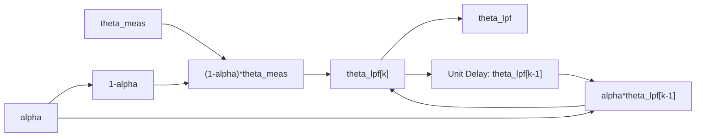
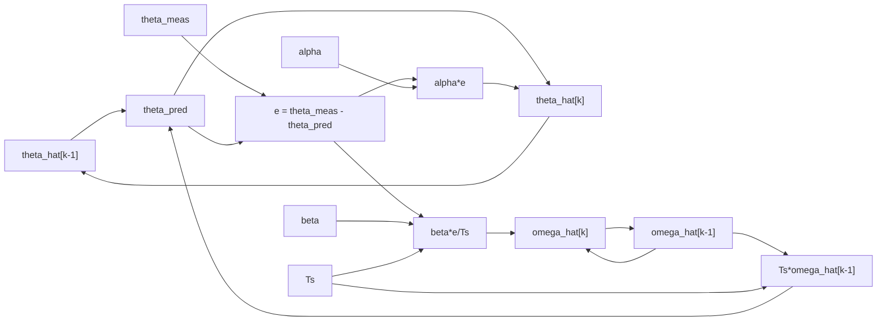
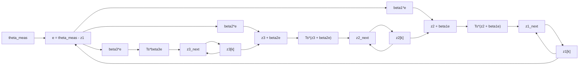

# LPF、α-β估计与离散 ESO 原理及 Simulink 实现说明

本文档用于说明当前“双线性 Hall 位置检测”仿真中三类角度处理方法的原理、代码实现方式，以及 Simulink 模型中每个关键 block 的作用。

对应工程文件如下。

| 文件 | 作用 |
|---|---|
| `init_dual_hall_noise_filter_params.m` | 设置 ADC 量化、白噪声、低通滤波、α-β估计、ESO 等参数 |
| `validate_dual_hall_noise_filter.m` | MATLAB 数值仿真，对比 ADC、噪声、LPF、α-β、ESO 的角度误差 |
| `build_dual_hall_discrete_eso_model.m` | 生成可展开查看的 Simulink 原理模型 |
| `models/dual_hall_discrete_eso.slx` | Simulink 模型，包含 LPF、α-β、ESO 三个估计子系统 |

当前信号链路可理解为：

```text
两路 Hall 电压
    -> ADC 量化 + 白噪声
    -> 零偏 / 幅值 / 相位 / 谐波等确定性补偿
    -> atan2 解算角度 theta_meas
    -> 角度域估计方法：LPF / α-β / ESO
    -> 输出角度估计、角速度估计、误差指标
```

需要注意：LPF、α-β、ESO 不是用来替代零偏、幅值、相位、谐波补偿的。零偏、幅值、相位、谐波属于确定性误差补偿；LPF、α-β、ESO 更偏向处理随机噪声、动态滞后和未建模扰动。

## 1. 三种方法的定位

| 方法 | 当前工程中的输入 | 输出 | 核心思想 | 主要优势 | 主要局限 |
|---|---|---|---|---|---|
| 一阶 LPF | 电压或角度测量值 | 平滑后的电压或角度 | 当前值与上一拍滤波值加权平均 | 简单，能压高频噪声 | 会引入相位滞后，运动越快越明显 |
| α-β估计 | 补偿后的角度 `theta_meas` | 角度 `theta_hat`、角速度 `omega_hat` | 用“角度-速度”模型预测，再用测量误差校正 | 比单纯 LPF 更适合运动角度估计 | 假设短时间近似匀速，对强冲击和复杂扰动有限 |
| 离散 ESO | 补偿后的角度 `theta_meas` | `z1` 角度、`z2` 角速度、`z3` 总扰动 | 把未知扰动扩张成一个状态一起估计 | 可处理未建模动态和扰动 | 参数更敏感，在单纯白噪声恒速场景优势不一定明显 |

## 2. 一阶 LPF 原理

### 2.1 基本思想

LPF 是 Low-Pass Filter，即低通滤波器。它允许低频信号通过，削弱高频信号。

在 Hall 角度检测里：

| 信号成分 | 典型表现 | LPF 对它的作用 |
|---|---|---|
| 真实角度变化 | 低频或中频变化 | 尽量保留 |
| ADC 抖动 | 高频小幅抖动 | 削弱 |
| 白噪声 | 频带较宽的随机扰动 | 削弱高频部分 |
| 电源噪声、采样噪声 | 高频成分较多 | 削弱 |

但 LPF 有一个重要副作用：输出会滞后于输入。滤波越强，滞后越明显。对于云台角度反馈来说，滞后会直接变成角度估计误差。

### 2.2 连续形式

一阶低通的连续形式为：

$$
\tau \frac{dy(t)}{dt} + y(t) = x(t)
$$

其中：

| 符号 | 含义 |
|---|---|
| $x(t)$ | 输入信号 |
| $y(t)$ | 滤波输出 |
| $\tau$ | 时间常数 |

截止频率与时间常数的关系为：

$$
f_c = \frac{1}{2\pi \tau}
$$

### 2.3 离散形式

当前工程采用的一阶离散低通形式为：

$$
y[k] = \alpha y[k-1] + (1-\alpha)x[k]
$$

其中：

| 符号 | 含义 |
|---|---|
| $x[k]$ | 当前采样输入 |
| $y[k]$ | 当前滤波输出 |
| $y[k-1]$ | 上一拍滤波输出 |
| $\alpha$ | 滤波系数，通常在 0 到 1 之间 |

`α` 的作用：

| `α` 取值 | 效果 |
|---|---|
| 接近 0 | 更相信当前测量，响应快，滤波弱 |
| 接近 1 | 更相信历史输出，曲线更平滑，滞后更大 |

参数文件中的计算为：

```matlab
hall_lpf_cutoff_hz = 300;
hall_lpf_tau_s = 1/(2*pi*hall_lpf_cutoff_hz);
hall_lpf_alpha = exp(-hall_ts_sim_s/hall_lpf_tau_s);
```

对应含义：

| 代码变量 | 中文含义 |
|---|---|
| `hall_lpf_cutoff_hz` | 一阶低通截止频率 |
| `hall_lpf_tau_s` | 一阶低通时间常数 |
| `hall_ts_sim_s` | 仿真采样周期 |
| `hall_lpf_alpha` | 离散一阶低通滤波系数 |

### 2.4 MATLAB 代码实现

在 `validate_dual_hall_noise_filter.m` 中，电压域 LPF 的调用为：

```matlab
hall_s_filt_v = first_order_lpf(hall_s_noisy_adc_v, hall_lpf_alpha);
hall_c_filt_v = first_order_lpf(hall_c_noisy_adc_v, hall_lpf_alpha);
```

这里的含义是：先对采样后的两路 Hall 电压做低通滤波，再把滤波后的电压送入后续补偿和 `atan2` 解角。

LPF 函数为：

```matlab
function y = first_order_lpf(x, alpha)
y = zeros(size(x));
y(1) = x(1);
for idx = 2:numel(x)
    y(idx) = alpha*y(idx-1) + (1 - alpha)*x(idx);
end
end
```

逐行解释：

| 代码 | 作用 |
|---|---|
| `y = zeros(size(x));` | 初始化输出数组，长度与输入一致 |
| `y(1) = x(1);` | 第一拍没有历史滤波值，直接用当前输入作为初值 |
| `for idx = 2:numel(x)` | 从第二个采样点开始递推 |
| `alpha*y(idx-1)` | 上一拍滤波输出的贡献 |
| `(1 - alpha)*x(idx)` | 当前输入的贡献 |
| `y(idx) = ...` | 得到当前滤波输出 |

### 2.5 Simulink 中的 LPF 子系统

对应子系统：`angle_LPF_after_decoding`

注意：在 MATLAB 验证脚本中，LPF 主要用于 Hall 电压；在 `dual_hall_discrete_eso.slx` 原理模型中，为了和 α-β、ESO 放在同一个角度估计层对比，LPF 子系统是角度域 LPF。两者公式相同，只是输入对象不同。

子系统公式为：

$$
\theta_{lpf}[k] = \alpha\theta_{lpf}[k-1] + (1-\alpha)\theta_{meas}[k]
$$

| Block 名称 | 类型 | 对应公式 | 作用 |
|---|---|---|---|
| `theta_meas` | In1 | $\theta_{meas}[k]$ | 输入当前 Hall 解算角度 |
| `alpha` | In1 | $\alpha$ | 输入滤波系数 |
| `one` | Constant | 1 | 提供常数 1 |
| `1 - alpha` | Sum | $1-\alpha$ | 计算当前测量的权重 |
| `Unit Delay theta_lpf` | Unit Delay | $\theta_{lpf}[k-1]$ | 保存上一拍滤波输出 |
| `alpha_times_prev` | Product | $\alpha\theta_{lpf}[k-1]$ | 计算历史项贡献 |
| `one_minus_alpha_times_meas` | Product | $(1-\alpha)\theta_{meas}[k]$ | 计算当前测量项贡献 |
| `theta_lpf_next` | Sum | 两项相加 | 得到当前滤波输出 |
| `theta_lpf` | Out1 | $\theta_{lpf}[k]$ | 输出滤波后的角度 |

LPF 信号流示意：



### 2.6 当前仿真中 LPF 的表现

在你的结果中，电压 LPF 能让电压曲线更平滑，但角度误差不一定更小。原因是：

1. Hall 信号对应的是正在旋转的角度；
2. LPF 对运动信号会产生滞后；
3. 滞后在角度域表现为系统性偏差；
4. 所以“电压噪声变小”不一定等于“最终角度误差变小”。

这就是图中 `Voltage LPF` 指标可能比 `ADC+noise` 更差的原因。

## 3. α-β估计原理

### 3.1 基本思想

α-β估计器不是直接平均，也不是单纯低通。它假设短时间内角度近似匀速变化：

$$
\theta[k] \approx \theta[k-1] + T_s\omega[k-1]
$$

因此它内部维护两个状态：

| 状态 | 含义 |
|---|---|
| $\theta_{hat}$ | 角度估计 |
| $\omega_{hat}$ | 角速度估计 |

每个采样周期分两步：

1. 预测：用上一拍角度和速度预测当前角度；
2. 校正：用测量角度和预测角度之间的误差修正角度和速度。

### 3.2 核心公式

预测：

$$
\theta_{pred}[k] = \theta_{hat}[k-1] + T_s\omega_{hat}[k-1]
$$

$$
\omega_{pred}[k] = \omega_{hat}[k-1]
$$

测量残差，也叫 innovation：

$$
e[k] = \theta_{meas}[k] - \theta_{pred}[k]
$$

校正：

$$
\theta_{hat}[k] = \theta_{pred}[k] + \alpha e[k]
$$

$$
\omega_{hat}[k] = \omega_{pred}[k] + \frac{\beta}{T_s}e[k]
$$

参数含义：

| 符号 | 含义 |
|---|---|
| $T_s$ | 采样周期 |
| $\alpha$ | 角度校正系数 |
| $\beta$ | 速度校正系数 |
| $e[k]$ | 测量相对预测的误差 |

### 3.3 α 和 β 的调节效果

| 参数变化 | 结果 |
|---|---|
| $\alpha$ 变大 | 角度更快贴近测量，动态更快，但噪声更明显 |
| $\alpha$ 变小 | 角度更平滑，但跟踪滞后更大 |
| $\beta$ 变大 | 速度估计修正更快，对变速更敏感，但容易放大噪声 |
| $\beta$ 变小 | 速度更平稳，但加减速时跟踪慢 |

当前参数文件中：

```matlab
hall_ab_alpha = 0.22;
hall_ab_beta = 0.018;
```

这是一组偏保守的参数，目的是在白噪声场景下平滑角度，同时保留一定动态跟踪能力。

### 3.4 MATLAB 代码实现

调用位置：

```matlab
[theta_ab_mag, omega_ab_mag] = alpha_beta_filter( ...
    result_noisy.theta_anglecomp, hall_ts_sim_s, hall_ab_alpha, hall_ab_beta);
theta_ab_mag = align_angle(theta_ab_mag, theta_mag);
err_ab = wrap_pi(theta_ab_mag - theta_mag)/P.pole_pairs;
omega_ab_mech = omega_ab_mag/P.pole_pairs;
```

含义：

| 代码 | 作用 |
|---|---|
| `result_noisy.theta_anglecomp` | 补偿后、含噪声的角度测量 |
| `hall_ts_sim_s` | 采样周期 |
| `hall_ab_alpha` | 角度修正系数 |
| `hall_ab_beta` | 速度修正系数 |
| `align_angle(...)` | 对齐角度展开后的初始周期 |
| `wrap_pi(...)` | 把误差限制到 $[-\pi,\pi]$ |
| `/P.pole_pairs` | 从磁场角误差转换为机械角误差 |

函数实现：

```matlab
function [theta_hat, omega_hat] = alpha_beta_filter(theta_meas, Ts, alpha, beta)
theta_meas = theta_meas(:);
theta_hat = zeros(size(theta_meas));
omega_hat = zeros(size(theta_meas));

theta_hat(1) = theta_meas(1);
if numel(theta_meas) >= 2
    omega_hat(1) = (theta_meas(2) - theta_meas(1))/Ts;
end

for idx = 2:numel(theta_meas)
    theta_pred = theta_hat(idx-1) + Ts*omega_hat(idx-1);
    omega_pred = omega_hat(idx-1);

    innovation = theta_meas(idx) - theta_pred;
    theta_hat(idx) = theta_pred + alpha*innovation;
    omega_hat(idx) = omega_pred + beta/Ts*innovation;
end
end
```

逐段解释：

| 代码 | 对应原理 |
|---|---|
| `theta_hat(1) = theta_meas(1);` | 初始角度估计等于第一拍测量角度 |
| `omega_hat(1) = (theta_meas(2)-theta_meas(1))/Ts;` | 用前两拍角度差估计初始角速度 |
| `theta_pred = theta_hat(idx-1) + Ts*omega_hat(idx-1);` | 角度预测 |
| `omega_pred = omega_hat(idx-1);` | 假设短时间角速度不变 |
| `innovation = theta_meas(idx) - theta_pred;` | 当前测量和预测的差 |
| `theta_hat(idx) = theta_pred + alpha*innovation;` | 用 α 修正角度 |
| `omega_hat(idx) = omega_pred + beta/Ts*innovation;` | 用 β 修正角速度 |

### 3.5 Simulink 中的 α-β 子系统

对应子系统：`alpha_beta_estimator`

| Block 名称 | 类型 | 对应公式 | 作用 |
|---|---|---|---|
| `theta_meas` | In1 | $\theta_{meas}[k]$ | 输入当前测量角度 |
| `Ts` | In1 | $T_s$ | 输入采样周期 |
| `alpha` | In1 | $\alpha$ | 输入角度修正系数 |
| `beta` | In1 | $\beta$ | 输入速度修正系数 |
| `Unit Delay theta_hat` | Unit Delay | $\theta_{hat}[k-1]$ | 保存上一拍角度估计 |
| `Unit Delay omega_hat` | Unit Delay | $\omega_{hat}[k-1]$ | 保存上一拍角速度估计 |
| `Ts_times_omega` | Product | $T_s\omega_{hat}[k-1]$ | 计算一个采样周期内的角度增量 |
| `theta_pred` | Sum | $\theta_{hat}[k-1]+T_s\omega_{hat}[k-1]$ | 得到预测角度 |
| `e = theta_meas - theta_pred` | Sum | $e[k]$ | 计算测量残差 |
| `alpha_e` | Product | $\alpha e[k]$ | 计算角度校正量 |
| `theta_hat_next` | Sum | $\theta_{pred}[k]+\alpha e[k]$ | 得到当前角度估计 |
| `beta_e` | Product | $\beta e[k]$ | 计算速度校正的分子 |
| `beta_e_over_Ts` | Product | $\beta e[k]/T_s$ | 计算角速度校正量 |
| `omega_hat_next` | Sum | $\omega_{hat}[k-1]+\beta e[k]/T_s$ | 得到当前角速度估计 |
| `theta_hat` | Out1 | $\theta_{hat}[k]$ | 输出角度估计 |
| `omega_hat` | Out1 | $\omega_{hat}[k]$ | 输出角速度估计 |

α-β 信号流示意：



### 3.6 与 LPF 的本质区别

LPF 只做平滑：

$$
y[k] = \alpha y[k-1] + (1-\alpha)x[k]
$$

α-β 会先预测再校正：

$$
\theta_{pred} = \theta_{hat} + T_s\omega_{hat}
$$

所以 α-β 知道“角度本来就在运动”，它不是把信号简单拖慢，而是利用速度状态预测下一拍位置。因此在云台角度反馈中，α-β 通常比直接低通更合理。

## 4. 离散 ESO 原理

### 4.1 基本思想

ESO 是 Extended State Observer，即扩张状态观测器。它的关键思想是：除了估计角度和角速度，还把未知扰动当成一个状态估计出来。

在当前 Hall 角度估计场景中，ESO 的三个状态为：

| 状态 | 含义 |
|---|---|
| $z_1$ | 角度估计，近似 $\theta$ |
| $z_2$ | 角速度估计，近似 $\omega$ |
| $z_3$ | 总扰动估计，近似 $d$ |

这里的总扰动 $d$ 可以包含：

| 扰动来源 | 例子 |
|---|---|
| 传感器误差 | 剩余谐波、白噪声、ADC 误差 |
| 环境变化 | 温漂、电源波动 |
| 装配变化 | Hall 安装偏差、磁钢偏心变化 |
| 机械动态 | 冲击、振动、负载扰动 |
| 未建模项 | 多轴结构耦合、摩擦、柔性环节 |

### 4.2 离散 ESO 核心公式

测量误差：

$$
e[k] = \theta_{meas}[k] - z_1[k]
$$

状态更新：

$$
z_1[k+1] = z_1[k] + T_s(z_2[k] + \beta_1 e[k])
$$

$$
z_2[k+1] = z_2[k] + T_s(z_3[k] + \beta_2 e[k])
$$

$$
z_3[k+1] = z_3[k] + T_s\beta_3 e[k]
$$

参数含义：

| 符号 | 含义 |
|---|---|
| $z_1$ | 角度估计 |
| $z_2$ | 角速度估计 |
| $z_3$ | 总扰动估计 |
| $e$ | 测量角度和估计角度之间的误差 |
| $\beta_1,\beta_2,\beta_3$ | ESO 观测器增益 |

### 4.3 ESO 增益与带宽

当前工程采用带宽法设置 ESO 增益：

$$
\beta_1 = 3\omega_o
$$

$$
\beta_2 = 3\omega_o^2
$$

$$
\beta_3 = \omega_o^3
$$

代码中为：

```matlab
hall_eso_bandwidth_hz = 80;
hall_eso_omega_o_rad_s = 2*pi*hall_eso_bandwidth_hz;
hall_eso_beta1 = 3*hall_eso_omega_o_rad_s;
hall_eso_beta2 = 3*hall_eso_omega_o_rad_s^2;
hall_eso_beta3 = hall_eso_omega_o_rad_s^3;
```

含义：

| 代码变量 | 含义 |
|---|---|
| `hall_eso_bandwidth_hz` | ESO 观测器带宽 |
| `hall_eso_omega_o_rad_s` | 角频率形式的 ESO 带宽 |
| `hall_eso_beta1` | 角度误差反馈增益 |
| `hall_eso_beta2` | 角速度误差反馈增益 |
| `hall_eso_beta3` | 总扰动误差反馈增益 |

带宽越高，ESO 跟踪越快，但对噪声越敏感。带宽越低，输出更平滑，但动态滞后更明显。

### 4.4 MATLAB 代码实现

调用位置：

```matlab
[theta_eso_mag, omega_eso_mag, disturbance_eso_mag] = discrete_eso_filter( ...
    result_noisy.theta_anglecomp, hall_ts_sim_s, ...
    hall_eso_beta1, hall_eso_beta2, hall_eso_beta3);
theta_eso_mag = align_angle(theta_eso_mag, theta_mag);
err_eso = wrap_pi(theta_eso_mag - theta_mag)/P.pole_pairs;
omega_eso_mech = omega_eso_mag/P.pole_pairs;
disturbance_eso_mech = disturbance_eso_mag/P.pole_pairs;
```

含义：

| 代码 | 作用 |
|---|---|
| `result_noisy.theta_anglecomp` | 确定性补偿后的含噪角度测量 |
| `hall_ts_sim_s` | 采样周期 |
| `hall_eso_beta1/2/3` | ESO 三个观测器增益 |
| `theta_eso_mag` | ESO 输出的磁场角估计 |
| `omega_eso_mag` | ESO 输出的磁场角速度估计 |
| `disturbance_eso_mag` | ESO 输出的磁场角扰动估计 |
| `/P.pole_pairs` | 转换为机械角相关量 |

ESO 函数：

```matlab
function [z1, z2, z3] = discrete_eso_filter(theta_meas, Ts, beta1, beta2, beta3)
theta_meas = theta_meas(:);
z1 = zeros(size(theta_meas));
z2 = zeros(size(theta_meas));
z3 = zeros(size(theta_meas));

z1(1) = theta_meas(1);
z2(1) = 0;
z3(1) = 0;

for idx = 2:numel(theta_meas)
    err = theta_meas(idx-1) - z1(idx-1);
    z1(idx) = z1(idx-1) + Ts*(z2(idx-1) + beta1*err);
    z2(idx) = z2(idx-1) + Ts*(z3(idx-1) + beta2*err);
    z3(idx) = z3(idx-1) + Ts*(beta3*err);
end
end
```

逐行解释：

| 代码 | 对应原理 |
|---|---|
| `theta_meas = theta_meas(:);` | 把输入统一成列向量 |
| `z1 = zeros(...)` | 初始化角度估计数组 |
| `z2 = zeros(...)` | 初始化角速度估计数组 |
| `z3 = zeros(...)` | 初始化总扰动估计数组 |
| `z1(1) = theta_meas(1);` | 初始角度等于第一拍测量值 |
| `z2(1) = 0;` | 初始角速度设为 0 |
| `z3(1) = 0;` | 初始扰动设为 0 |
| `err = theta_meas(idx-1) - z1(idx-1);` | 计算测量误差 |
| `z1(idx) = ...` | 更新角度估计 |
| `z2(idx) = ...` | 更新角速度估计 |
| `z3(idx) = ...` | 更新总扰动估计 |

### 4.5 Simulink 中的 ESO 子系统

对应子系统：`discrete_ESO_estimator`

| Block 名称 | 类型 | 对应公式 | 作用 |
|---|---|---|---|
| `theta_meas` | In1 | $\theta_{meas}[k]$ | 输入当前角度测量 |
| `Ts` | In1 | $T_s$ | 输入采样周期 |
| `beta1` | In1 | $\beta_1$ | 输入角度误差反馈增益 |
| `beta2` | In1 | $\beta_2$ | 输入角速度误差反馈增益 |
| `beta3` | In1 | $\beta_3$ | 输入扰动误差反馈增益 |
| `Unit Delay z1` | Unit Delay | $z_1[k]$ | 保存当前用于更新的角度估计状态 |
| `Unit Delay z2` | Unit Delay | $z_2[k]$ | 保存当前用于更新的角速度估计状态 |
| `Unit Delay z3` | Unit Delay | $z_3[k]$ | 保存当前用于更新的总扰动估计状态 |
| `e = theta_meas - z1` | Sum | $e[k]$ | 计算测量误差 |
| `beta1_e` | Product | $\beta_1 e[k]$ | 计算角度误差反馈 |
| `beta2_e` | Product | $\beta_2 e[k]$ | 计算角速度误差反馈 |
| `beta3_e` | Product | $\beta_3 e[k]$ | 计算扰动误差反馈 |
| `z2 + beta1e` | Sum | $z_2[k]+\beta_1e[k]$ | 形成 $z_1$ 更新项 |
| `z3 + beta2e` | Sum | $z_3[k]+\beta_2e[k]$ | 形成 $z_2$ 更新项 |
| `Ts_times_z1_update` | Product | $T_s(z_2+\beta_1e)$ | 计算 $z_1$ 增量 |
| `Ts_times_z2_update` | Product | $T_s(z_3+\beta_2e)$ | 计算 $z_2$ 增量 |
| `Ts_times_z3_update` | Product | $T_s\beta_3e$ | 计算 $z_3$ 增量 |
| `z1_next` | Sum | $z_1[k]+T_s(...)$ | 得到下一拍 $z_1$ |
| `z2_next` | Sum | $z_2[k]+T_s(...)$ | 得到下一拍 $z_2$ |
| `z3_next` | Sum | $z_3[k]+T_s(...)$ | 得到下一拍 $z_3$ |
| `z1` | Out1 | $z_1$ | 输出角度估计 |
| `z2` | Out1 | $z_2$ | 输出角速度估计 |
| `z3` | Out1 | $z_3$ | 输出总扰动估计 |

ESO 信号流示意：



### 4.6 ESO 当前效果为什么不一定明显

当前噪声仿真主要是：

```text
恒速运动 + ADC 量化 + 白噪声
```

这个场景下，α-β估计已经很适合，因为它的“角度-速度”模型正好匹配恒速运动。ESO 的额外状态 `z3` 主要用于估计扰动，但当前没有明显的低频扰动、冲击、负载变化或结构耦合，因此 ESO 的优势不一定超过 α-β。

ESO 更有价值的场景是：

| 场景 | ESO 价值 |
|---|---|
| 变速运动 | `z2` 和 `z3` 能帮助跟踪速度变化 |
| 外部冲击 | `z3` 能反映突发扰动 |
| 负载扰动 | `z3` 可表示等效扰动 |
| 多轴结构耦合 | `z3` 可吸收未建模耦合项 |
| 温漂和安装微变 | `z3` 可跟踪慢变化残差 |

因此你当前 PPT 中的结论是合理的：

```text
在当前恒速 + 白噪声场景下，α-β已经能较好满足角度估计需求；
ESO 对随机噪声有一定抑制，但优势不明显；
ESO 的价值更多体现在后续存在变速、冲击、负载扰动、结构耦合和未建模残差的工况中。
```

## 5. Simulink 顶层模型结构

模型：`models/dual_hall_discrete_eso.slx`

顶层主要 block：

| Block 名称 | 类型 | 作用 |
|---|---|---|
| `theta_meas_from_hall` | From Workspace | 输入模拟的 Hall 解角结果，作为测量角度 |
| `theta_true_reference` | From Workspace | 输入真实角度，用于误差计算 |
| `Ts` | Constant | 采样周期 |
| `alpha_lpf` | Constant | LPF 滤波系数 |
| `alpha_ab` | Constant | α-β 的角度修正系数 |
| `beta_ab` | Constant | α-β 的速度修正系数 |
| `beta1_eso` | Constant | ESO 第一增益 |
| `beta2_eso` | Constant | ESO 第二增益 |
| `beta3_eso` | Constant | ESO 第三增益 |
| `angle_LPF_after_decoding` | Subsystem | 角度域一阶低通滤波 |
| `alpha_beta_estimator` | Subsystem | α-β角度和角速度估计 |
| `discrete_ESO_estimator` | Subsystem | 离散 ESO 角度、角速度和扰动估计 |
| `angle_error_calc` | MATLAB Function | 计算测量、LPF、α-β、ESO 的角度误差 |
| `estimate_scope_mux` | Mux | 仅用于把多路角度估计接到同一个 Scope |
| `error_scope_mux` | Mux | 仅用于把多路误差接到同一个 Scope |
| `eso_state_mux` | Mux | 仅用于把 `z1/z2/z3` 接到同一个 Scope |
| `scope_angle_estimates` | Scope | 查看角度估计对比 |
| `scope_angle_errors` | Scope | 查看角度误差对比 |
| `scope_eso_states` | Scope | 查看 ESO 三个状态 |

当前模型已删除 `To Workspace` 模块。正式绘图和指标计算由 `validate_dual_hall_noise_filter.m` 完成，Simulink 主要用于展示三种估计算法的 block 原理。

## 6. 三种方法的工程对比

| 对比项 | LPF | α-β估计 | 离散 ESO |
|---|---|---|---|
| 处理对象 | 电压或角度 | 角度 | 角度 |
| 是否估计速度 | 否 | 是 | 是 |
| 是否估计扰动 | 否 | 否 | 是 |
| 主要参数 | 截止频率或 `α` | `α`、`β` | 观测器带宽、`β1~β3` |
| 对白噪声 | 能平滑，但可能滞后 | 平滑且保持动态 | 可平滑，但参数敏感 |
| 对相位滞后 | 容易引入 | 较小 | 取决于带宽 |
| 对变速 | 一般 | 较好 | 较好 |
| 对冲击/扰动 | 较弱 | 一般 | 更有潜力 |
| 当前恒速白噪声场景 | 不推荐作为最终角度估计 | 推荐 | 可作为后续复杂工况储备 |

一句话理解：

| 方法 | 一句话 |
|---|---|
| LPF | 用历史输出拖住当前测量，让曲线变平滑，但会滞后 |
| α-β | 用速度预测角度，再用测量误差修正角度和速度 |
| ESO | 在估计角度和速度的同时，把未知扰动也估计出来 |

## 7. 当前仿真结果的解释

在 `validate_dual_hall_noise_filter.m` 当前图中：

| 图 | 说明 |
|---|---|
| 图 a | 显示 clean、ADC+noise、ADC+noise+LPF 的 Hall 电压，观察电压波形是否明显被噪声污染或滤波平滑 |
| 图 b | 显示电压域误差，主要用于看 ADC、白噪声和电压 LPF 对 Hall 电压采样误差的影响 |
| 图 c | 显示最终机械角误差，对比 clean、ADC+noise、Voltage LPF、Alpha-beta、Discrete ESO |
| 图 d | 用最大误差和 RMS 误差量化各方法效果 |

为什么图 a、b 不显示 α-β 和 ESO？

因为 α-β 和 ESO 是角度域方法。它们不是直接处理 Hall 电压，而是在补偿和 `atan2` 解角之后处理角度。因此它们应该出现在图 c、d 中，而不是电压波形图 a、b 中。

## 8. 后续建议

如果要进一步体现 ESO 的价值，建议不要只停留在恒速白噪声场景，而应加入更接近云台实机的工况：

| 后续工况 | 目的 |
|---|---|
| 低速 1 rpm / 5 rpm | 验证低速角度估计稳定性 |
| 加减速 | 比较 α-β 与 ESO 的动态跟踪能力 |
| 小角度往复摆动 | 接近云台稳定控制场景 |
| 外部冲击扰动 | 验证 ESO 对突发扰动的估计能力 |
| 负载扰动 | 验证 ESO 的总扰动估计是否有意义 |
| 多轴耦合扰动 | 为后续三轴云台控制方案做铺垫 |

推荐下一步仿真顺序：

1. 保留当前恒速 + 白噪声结果作为基准；
2. 加入加减速工况，对比 α-β 与 ESO 的动态跟踪；
3. 加入冲击扰动或小角度往复摆动，看 ESO 的 `z3` 是否能反映未建模扰动；
4. 再考虑和 IMU 姿态估计、云台控制环连接。

