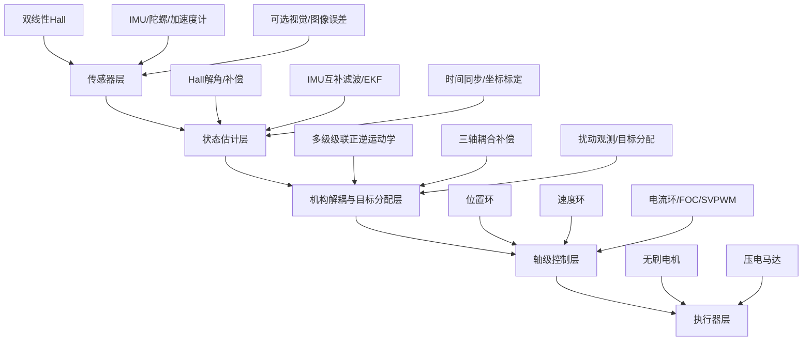

# 双线性霍尔位置检测方案规划与学习路线

## 1. 你这部分工作的定位

你负责的不是单纯“选一个霍尔传感器”，而是设计一套面向特制云台电机的低成本角度检测单元：

```text
两颗线性霍尔 + 磁钢/磁环 + 结构布置 + 标定补偿算法 + 与 IMU/控制器融合接口
```

它的工程角色可以理解为一个“自制磁编码器”。线性霍尔本身不是编码器，但两路近似正交的 Hall 电压经过 `atan2`、误差补偿和滤波后，可以输出云台轴角度和角速度，功能上承担编码器的作用。

在整个云台系统中，它主要服务于以下环节：

| 环节 | 双线性霍尔的作用 |
|---|---|
| 电机/关节角度检测 | 测量每个云台轴或电机轴的相对转角 |
| 位置环 | 提供当前轴角度反馈 |
| 速度环 | 由角度差分或观测器得到轴角速度 |
| FOC/电机控制 | 必要时提供转子电角度或辅助换相角度 |
| IMU 融合 | 与陀螺/加速度计互补，获得低漂移、高带宽姿态估计 |
| 多轴耦合控制 | 提供各级关节实际角度，用于级联机构解耦与坐标变换 |

一句话总结：**双线性霍尔负责“轴在哪里”，IMU 负责“云台/相机姿态怎么动”，后面的控制模块负责“如何让它动到目标位置并抵抗扰动”。**

## 2. 项目已知约束与设计边界

根据 `手持相机云台相关资料_图片信息提取.md` 中图片 11-12 的信息，本项目传感器方案已经有一组比较明确的工程边界，后续双线性霍尔方案应围绕这些条件展开，而不是按通用编码器方案发散。

| 项目 | 已知信息 | 对双线性霍尔方案的影响 |
|---|---|---|
| 机构形式 | 3 级级联系统，3 级间存在耦合，需要解耦 | Hall 不只是单轴反馈，还要给多级机构解耦提供各级关节角 |
| 第一级角度范围 | 约 -235° 到 58° | 第一级是大角度轴，Hall 解角必须支持大范围连续角度展开 |
| 第二级角度范围 | 约 -45° 到 45° | 第二级为中等摆角，可重点关注小角度线性度、滞后和重复性 |
| 第三级角度范围 | 约 -120° 到 70° | 第三级也属于大角度摆动，需要考虑跨象限 `atan2` 和边界连续性 |
| 磁钢信息 | 18 mm 中空磁钢 | 磁路和 PCB 布局应优先围绕中空磁钢布置，不建议临时外加大体积编码器 |
| 极数信息 | 6x12 极 | Hall 信号可能存在多周期映射，需要明确机械角、电角度和磁场周期数关系 |
| ADC 条件 | 16 bit ADC | 具备较高采样分辨率，方案重点转向噪声、安装误差和磁场非理想补偿 |
| Hall 数量 | 检测性能依赖 2 个线性 Hall 器件 | 每轴固定按双 Hall 方案设计，不配置第三路冗余 |
| 负载 | 约 20-30 g | 需要验证负载扰动下角度反馈稳定性，尤其是低速、大角度、冲击工况 |
| 绝对位置/姿态基准 | IMU | IMU 是全局姿态基准，Hall 是各级关节相对角反馈，两者必须融合 |

因此，本规划后续默认采用如下系统假设：

```text
每级旋转轴：18 mm 中空磁钢 + 2 个线性 Hall + 16 bit ADC
检测输出：该级关节相对角 theta_i、角速度 omega_i、信号可信度 valid_i
全局基准：IMU 提供相机/云台姿态基准
控制对象：20-30 g 负载下的三级大角度级联云台
```


## 3. 总体技术路线

本项目总体技术路线选定为：**归一化 + 谐波重构 + ESO 复合信号提取**。

该路线的目标不是只把两路 Hall 信号简单送入 `atan2`，而是在解角前先处理真实 Hall 信号中的三类主要问题：

| 问题 | 典型来源 | 对策 |
|---|---|---|
| 幅值不一致 | 两颗 Hall 灵敏度不同、气隙不同、PCB 安装误差 | 零偏校正 + 幅值归一化 |
| 高次谐波 | 磁钢磁化不均匀、偏心、齿槽/结构磁场畸变 | FFT 识别谐波 + 多角公式重构 |
| 未建模噪声和残差 | ADC 噪声、电磁干扰、温漂、动态扰动 | ESO 估计残差并抑制 |

因此，后续方案不再只写成“基础 atan2 解角”，而是以“先把两路 Hall 信号尽量恢复成理想正余弦，再进行解角”为主线。


两路 Hall 的理想输出为：

$$
H_s = A_s \sin(\theta) + o_s
$$

$$
H_c = A_c \cos(\theta) + o_c
$$

但实际 Hall 输出更接近：

$$
H_s
=
o_s
+
A_s\sin(\theta)
+
\sum_{k=2}^{N}
\left[
a_{s,k}\sin(k\theta)+b_{s,k}\cos(k\theta)
\right]
+
n_s
$$

$$
H_c
=
o_c
+
A_c\cos(\theta)
+
\sum_{k=2}^{N}
\left[
a_{c,k}\sin(k\theta)+b_{c,k}\cos(k\theta)
\right]
+
n_c
$$

其中 `o_s/o_c` 是零偏，`A_s/A_c` 是幅值，求和项是磁场谐波和结构误差，`n_s/n_c` 是噪声和未建模扰动。

第一步先做零偏校正和幅值归一化：

$$
x_s=\frac{H_s-o_s}{A_s}
$$

$$
x_c=\frac{H_c-o_c}{A_c}
$$

归一化后，理论目标是：

$$
x_s \rightarrow \sin(\theta),
\quad
x_c \rightarrow \cos(\theta)
$$

第二步通过 FFT 找出主要谐波阶次，例如 `3、5、7` 次等，然后建立谐波模型：

$$
\hat h_s(\theta)
=
\sum_{k\in\mathcal{K}}
\left[
\hat a_{s,k}\sin(k\theta)+\hat b_{s,k}\cos(k\theta)
\right]
$$

$$
\hat h_c(\theta)
=
\sum_{k\in\mathcal{K}}
\left[
\hat a_{c,k}\sin(k\theta)+\hat b_{c,k}\cos(k\theta)
\right]
$$

第三步用多角公式或等效查表方法重构主要谐波，并从原始归一化信号中抵消：

$$
x_s^{\prime}=x_s-\hat h_s(\theta)
$$

$$
x_c^{\prime}=x_c-\hat h_c(\theta)
$$

第四步用 ESO 对未被谐波模型解释的残差进行估计。可以把 ESO 理解为一个在线残差观测器：

$$
e=z_1-\theta_{\mathrm{m}}
$$

$$
\dot z_1=z_2-\beta_1 e
$$

$$
\dot z_2=z_3-\beta_2 e
$$

$$
\dot z_3=-\beta_3 e
$$

其中 `z_1` 估计角度，`z_2` 估计角速度，`z_3` 估计未建模残差或总扰动。实际实现时可先从离散化的一阶/二阶 ESO 开始，不必一开始追求完整复杂模型。

最后再进行 `atan2` 解角：

$$
\theta_{\mathrm{raw}}=\operatorname{atan2}(\tilde H_s,\tilde H_c)
$$

在选定路线下，更准确地写成：

$$
\theta_{\mathrm{raw}}
=
\operatorname{atan2}(x_s^{\prime},x_c^{\prime})
$$

补偿后的输出角度为：

$$
\hat{\theta}
=
\theta_{\mathrm{raw}}
-
\hat d_{\mathrm{ESO}}
$$

其中 `\hat d_{\mathrm{ESO}}` 表示 ESO 估计到的残差项。工程上也可以把谐波重构和 ESO 分成两个输出：谐波补偿负责处理确定性周期误差，ESO 负责处理动态残差和噪声。

如果磁钢为多极结构，则 Hall 输出的磁场周期可能不是一圈一个周期，需要建立机械角和磁场角之间的关系：

$$
\theta_{\mathrm{mag}} = n_m \theta_{\mathrm{mech}} + \theta_0
$$

其中 `n_m` 为磁场周期数，`theta_0` 为安装零位偏移。工程实现时需要通过标定确认 `n_m` 和零位，否则会出现角度周期混淆。

## 4. 具体规划方案

### 4.1 第一阶段：需求和指标确认

目标是把甲方要求转成传感器方案可执行的指标。

需要明确：

| 项目 | 建议确认内容 |
|---|---|
| 检测对象 | 优先定义为各级云台关节相对角；若兼作 FOC，则需额外输出电角度 |
| 角度范围 | 第一级约 -235° 到 58°，第二级约 -45° 到 45°，第三级约 -120° 到 70° |
| 目标精度 | 静态精度、重复精度、动态跟随误差 |
| 采样率 | Hall 采用 16 bit ADC，需进一步确认采样率、IMU 采样率和控制周期 |
| 延迟 | 位置反馈允许的最大延迟 |
| 体积成本 | 每轴只用两颗线性 Hall，不增加第三路冗余 |
| 机械约束 | 围绕 18 mm 中空磁钢进行 Hall 与 PCB 布局 |
| 负载工况 | 20-30 g 负载，覆盖低速、大角度、冲击扰动和多轴耦合 |
| 绝对基准 | IMU 是最终姿态/绝对位置基准，Hall 是各级关节相对位置反馈 |

这一阶段的输出：

- 双霍尔角度检测需求表；
- 每轴角度范围和精度目标；
- Hall、IMU、控制器采样率初步设定；
- 传感器与控制模块接口定义初稿。

### 4.2 第二阶段：磁路与结构方案设计

这一阶段决定原始 Hall 信号质量，是后面算法能否补偿好的基础。

重点设计内容：

| 设计对象 | 设计要点 |
|---|---|
| 18 mm 中空磁钢 | 优先复用项目已给定磁钢条件，保证旋转时磁场具有稳定周期性 |
| 6x12 极结构 | 明确机械角、电角度、磁场周期数的换算关系，避免多周期解角混淆 |
| 两颗 Hall 位置 | 目标相差 90° 磁场相位，形成正余弦信号 |
| 气隙 | 尽量稳定，避免机械偏心导致幅值波动 |
| PCB 布局 | 两颗 Hall 到磁钢距离一致，走线短，降低噪声 |
| 安装基准 | Hall、磁钢、轴承、电机定转子要有清晰定位基准 |

本项目结构方案选择第二种：**18 mm 中空磁钢 + 双 Hall**。另外两种方案只作为背景对比，不作为当前主线。

| 方案 | 特点 | 适用性 |
|---|---|---|
| 轴端径向磁钢 + 双 Hall | 结构简单，适合小型电机轴端检测 | 不作为当前主线，仅作为原理验证参考 |
| 18 mm 中空磁钢 + 双 Hall | 贴合项目已有磁钢条件，适合中空结构和大角度关节 | 当前选定方案 |
| 电机内部磁场复用 | 体积最省，但磁场畸变更复杂 | 不作为当前主线，后续结构深度集成时再评估 |

选定第二种方案后的具体规划如下：

| 规划项 | 具体要求 |
|---|---|
| 磁钢形式 | 使用项目已有 18 mm 中空磁钢，优先围绕中空轴/中空关节布置 |
| Hall 数量 | 每级轴固定使用 2 个线性 Hall，不增加第三路冗余 |
| Hall 相位 | 两颗 Hall 在有效磁场中尽量形成 90° 磁场相位差 |
| 安装位置 | Hall 固定在定子侧或静止 PCB 上，磁钢随转子/关节轴旋转 |
| 气隙控制 | 两颗 Hall 与磁钢之间的气隙尽量一致，避免偏心造成幅值调制 |
| 输出目标 | 得到每级关节角 `theta_i`、角速度 `omega_i` 和信号可信度 `valid_i` |
| 适用轴级 | 第一级、第二级、第三级均可采用同一检测架构，但标定参数独立保存 |

该方案与项目资料中的“检测性能依赖 2 个线性 Hall 器件”一致，优点是成本低、体积小、适合中空结构；主要风险是双 Hall 没有第三路冗余，因此必须通过幅值一致性、相位一致性、残差阈值和 IMU/电机模型交叉校验来做异常判断。

建议优先验证以下波形质量：

1. 两路 Hall 是否接近正弦/余弦；
2. 两路相位差是否接近 90°；
3. 旋转全行程内是否存在电压饱和；
4. 18 mm 中空磁钢的 6x12 极结构是否导致多周期解角；
5. 三个级联轴在各自角度范围内是否都能保持连续解角。

这一阶段的输出：

- 双 Hall 安装示意图；
- 18 mm 中空磁钢、双 Hall、PCB 的初步结构尺寸；
- 可能的磁场仿真或简单实验验证；
- 原始 Hall 波形质量判断：幅值、相位差、噪声、饱和情况。

### 4.3 第三阶段：信号采集与复合解角

目标是把两路模拟电压从“原始 Hall 波形”变成“可供控制器使用的轴角度和轴角速度”。本项目不采用单纯 `atan2`，而采用选定的 **归一化 + 谐波重构 + ESO 复合信号提取**。

基本处理链路：

```text
Hall ADC 原始值
-> 零偏校正
-> 幅值归一化
-> FFT 识别主要谐波
-> 建立谐波模型
-> 多角公式/查表重构谐波
-> 抵消主要谐波
-> ESO 估计残差
-> atan2 解角
-> unwrap 连续化
-> 角速度估计
```

第一步，ADC 原始值先转换为电压，或直接用归一化 ADC 量表示：

$$
H_s = \frac{ADC_s}{2^{N_{\mathrm{ADC}}}-1}\,V_{\mathrm{ref}}
$$

$$
H_c = \frac{ADC_c}{2^{N_{\mathrm{ADC}}}-1}\,V_{\mathrm{ref}}
$$

第二步，进行零偏校正和幅值归一化：

$$
x_s=\frac{H_s-o_s}{A_s}
$$

$$
x_c=\frac{H_c-o_c}{A_c}
$$

其中 `o_s/o_c` 由静态标定或全行程采样估计，`A_s/A_c` 由峰峰值或椭圆拟合估计。

第三步，做初始解角，用于给 FFT/谐波模型提供角度自变量：

$$
\theta_0
=
\operatorname{atan2}(x_s,x_c)
$$

第四步，对角度误差或两路归一化信号做 FFT，识别主要谐波阶次：

$$
\mathcal{K}=\{k_1,k_2,\cdots,k_m\}
$$

例如实验中常重点关注 `2、3、5、7` 次谐波，具体阶次由采样数据 FFT 结果决定，不提前写死。

第五步，建立谐波模型：

$$
\hat h_s(\theta_0)
=
\sum_{k\in\mathcal{K}}
\left[
\hat a_{s,k}\sin(k\theta_0)+\hat b_{s,k}\cos(k\theta_0)
\right]
$$

$$
\hat h_c(\theta_0)
=
\sum_{k\in\mathcal{K}}
\left[
\hat a_{c,k}\sin(k\theta_0)+\hat b_{c,k}\cos(k\theta_0)
\right]
$$

第六步，用多角公式或查表方式在线重构这些谐波，并从信号中抵消：

$$
x_s^{\prime}=x_s-\hat h_s(\theta_0)
$$

$$
x_c^{\prime}=x_c-\hat h_c(\theta_0)
$$

第七步，对补偿后的信号重新解角：

$$
\theta_{\mathrm{raw}}
=
\operatorname{atan2}(x_s^{\prime},x_c^{\prime})
$$

第八步，用 ESO 估计未建模残差和动态扰动，得到最终输出角度：

$$
\hat{\theta}
=
\theta_{\mathrm{raw}}
-
\hat d_{\mathrm{ESO}}
$$

最后，角速度可由差分、低通差分或 ESO 的速度状态得到：

$$
\omega
=
\frac{\hat{\theta}(k)-\hat{\theta}(k-1)}{T_s}
$$

如果 ESO 设计为二阶或三阶观测器，则可以直接取：

$$
\omega \approx z_2
$$

这一阶段的输出：

- MATLAB/Simulink 复合解角模型；
- 两路 Hall 原始波形图；
- 归一化后的 `sin/cos` 相图；
- FFT 频谱与主要谐波阶次；
- 谐波重构前后的信号对比；
- `atan2` 原始角度、谐波补偿角度、ESO 输出角度对比；
- 机械角、磁场角、电角度之间的换算关系；
- 可用于后续控制器的角度和角速度接口。

### 4.4 第四阶段：误差补偿与标定

两颗 Hall 成本低，但必须依靠标定补偿提高精度。本项目选定的方法二中，补偿重点不是单一查表，而是分成三层：

| 层级 | 作用 | 解决的问题 |
|---|---|---|
| 归一化层 | 零偏、幅值校正 | 两路 Hall 中点不同、幅值不同 |
| 谐波重构层 | FFT 识别 + 多角公式/查表重构 | 磁钢畸变、偏心、结构误差带来的周期误差 |
| ESO 残差层 | 在线估计未建模误差 | 噪声、温漂、动态扰动、剩余谐波 |

推荐补偿顺序调整为：

1. 零偏补偿；
2. 幅值补偿；
3. 初始 `atan2` 解角；
4. FFT 识别主要谐波；
5. 建立谐波模型；
6. 多角公式或查表重构主要谐波；
7. 抵消主要谐波；
8. ESO 估计剩余残差；
9. 输出补偿后的角度和角速度。

周期误差可写成傅里叶形式：

$$
e(\theta)=a_0+\sum_{n=1}^{N}
\left[
a_n\cos(n\theta)+b_n\sin(n\theta)
\right]
$$

若采用角度误差补偿方式，则补偿后角度为：

$$
\hat{\theta}
=
\theta_{\mathrm{raw}}
-
\hat e(\theta_{\mathrm{raw}})
$$

若采用信号谐波重构方式，则先补偿两路信号，再解角：

$$
x_s^{\prime}=x_s-\hat h_s(\theta_0)
$$

$$
x_c^{\prime}=x_c-\hat h_c(\theta_0)
$$

$$
\theta_{\mathrm{raw}}
=
\operatorname{atan2}(x_s^{\prime},x_c^{\prime})
$$

最后再叠加 ESO 残差估计：

$$
\hat{\theta}
=
\theta_{\mathrm{raw}}
-
\hat d_{\mathrm{ESO}}
$$

这里推荐在仿真阶段同时比较两种实现：

| 实现方式 | 特点 | 建议用途 |
|---|---|---|
| 角度误差查表/傅里叶补偿 | 实现简单，直接补偿 `theta_raw` | 早期快速验证 |
| 两路信号谐波重构 | 更贴近论文方法，可解释性强 | 作为本项目主线 |
| ESO 残差估计 | 抑制未建模误差和动态扰动 | 与谐波重构联合使用 |

推荐标定流程：


参考角度来源可以分阶段选择：

| 阶段 | 参考来源 |
|---|---|
| 早期实验 | 高精度旋转台、商用编码器、视觉测角 |
| 样机调试 | IMU 姿态 + 低速稳定运动数据 |
| 批量标定 | 工装限位点 + 标定轨迹 + 数据拟合 |

这一阶段的输出：

- 标定参数表；
- 每级轴、每台电机独立补偿参数；
- FFT 谐波阶次识别结果；
- 谐波重构参数；
- ESO 初始参数；
- 补偿前后误差对比图；
- 误差 RMS、峰峰值、滞后误差、重复性指标；
- 补偿前后 Lissajous 相图对比。

### 4.5 第五阶段：与 IMU 融合

双 Hall 适合低漂移轴角度，IMU 适合高频角速度和姿态扰动，两者互补。

推荐融合思路：

```text
Hall：低频可靠、无长期积分漂移、反映关节实际位置
Gyro：高频响应快、适合手抖和冲击，但会积分漂移
Accel：低频重力参考，但动态加速度下不可靠
```

简化互补滤波形式：

$$
\hat{\theta}(k)
=
\alpha
\left[
\hat{\theta}(k-1)+\omega_{\mathrm{gyro}}T_s
\right]
+
(1-\alpha)\theta_{\mathrm{Hall}}(k)
$$

在强扰动或冲击下，应降低加速度计权重，避免把线加速度误认为姿态变化。

这一阶段的输出：

- Hall-IMU 时间同步方案；
- Hall 角度与陀螺角速度融合算法；
- 静态、低速、大角度、冲击扰动下的融合效果图；
- 面向三级级联系统的统一状态量：各级关节角、关节角速度、IMU 姿态、IMU 角速度。

### 4.6 第六阶段：接入控制系统

你这部分最后要交付给后面的控制模块一个“干净、稳定、低延迟”的状态估计接口。

建议输出信号：

| 信号 | 含义 | 给谁用 |
|---|---|---|
| `theta_axis` | 当前轴角度 | 位置环、机构解耦 |
| `omega_axis` | 当前轴角速度 | 速度环、扰动观测 |
| `theta_e` | 电角度，可选 | FOC/Park 变换 |
| `theta_mag` | 磁场角，可选 | 多极磁场解角与标定 |
| `valid_flag` | Hall 信号是否可信 | 安全保护 |
| `error_metric` | 幅值/相位/残差异常指标 | 故障诊断 |
| `timestamp` | 采样时间戳 | 多传感器同步 |

对三级级联云台，建议统一命名为：

```text
theta_1, omega_1：第一级，约 -235° 到 58°
theta_2, omega_2：第二级，约 -45° 到 45°
theta_3, omega_3：第三级，约 -120° 到 70°
q_imu, gyro_imu：IMU 输出的姿态四元数和角速度
```

## 5. 学习路线

### 5.1 第一层：先搞懂线性霍尔如何变成角度

学习目标：

- 线性霍尔测的是磁场，不是直接测角度；
- 两路正交 Hall 信号可以通过 `atan2` 得到角度；
- 零偏、幅值、相位误差会直接造成角度误差。

建议学习内容：

1. 线性 Hall 输出原理；
2. 正弦/余弦编码器原理；
3. `atan2` 解角；
4. 电角度和机械角度关系；
5. ADC 分辨率、噪声、采样率对角度精度的影响。

推荐动手任务：

- 用 MATLAB 生成两路理想正余弦信号；
- 人为加入零偏、幅值不一致、相位误差；
- 观察 `atan2` 角度误差如何变化；
- 写一个基础补偿脚本。

### 5.2 第二层：学习误差建模和补偿

学习目标：

- 知道 Hall 误差不是随机乱跳，而是大量表现为角度相关的周期误差；
- 会用 FFT 找出主要谐波；
- 会用谐波模型或多角公式重构误差；
- 初步理解 ESO 如何估计未建模残差。

建议学习内容：

1. 傅里叶级数；
2. 谐波误差；
3. 查表补偿；
4. 标定曲线拟合；
5. 多角公式重构；
6. ESO / 扩张状态观测器基本思想；
7. 补偿前后误差评价指标。

推荐动手任务：

- 对模拟 Hall 信号加入 3、5、7 次谐波；
- 对角度误差做 FFT；
- 识别主要谐波阶次；
- 用傅里叶项或多角公式重构谐波；
- 从两路信号中抵消主要谐波；
- 加入随机噪声和慢变漂移，用简单 ESO 估计残差；
- 输出 `未补偿 / 谐波重构 / 谐波重构+ESO` 三组误差对比图。

### 5.3 第三层：学习 IMU 与 Hall 融合

学习目标：

- Hall 解决低漂移位置问题；
- 陀螺解决高频动态问题；
- 加速度计在冲击下不能盲目信任。

建议学习内容：

1. 陀螺积分；
2. 加速度计姿态修正；
3. 互补滤波；
4. 扩展卡尔曼滤波基本思想；
5. 时间同步和坐标系标定。

推荐动手任务：

- 用一段模拟角速度积分得到姿态；
- 加入陀螺零偏，观察漂移；
- 用 Hall 角度低频修正；
- 做一版互补滤波仿真。

### 5.4 第四层：学习与控制系统接口

学习目标：

- 知道你的输出最终进入位置环、速度环、FOC 和多轴解耦；
- 传感器算法不是孤立模块，延迟和噪声都会影响控制效果。

建议学习内容：

1. 电流环、速度环、位置环基本结构；
2. FOC 中电角度的作用；
3. 云台三轴坐标系；
4. 多级级联机构坐标变换；
5. 传感器延迟对闭环稳定性的影响。

推荐动手任务：

- 把 Hall 角度信号接入已有 FOC/位置环仿真；
- 调整滤波带宽，看位置环响应变化；
- 加入测量噪声和延迟，看控制误差变化。

## 6. 你和后面模块的关系

### 6.1 与 BLDC/FOC 控制模块的关系

FOC 模块需要知道转子电角度，才能做 Park/反 Park 变换：

```text
双 Hall 角度 -> 机械角 theta_m -> 电角度 theta_e = pole_pairs * theta_m
```

如果后续使用其他换相传感器或无感算法，双 Hall 仍可作为低速和位置环反馈；如果要求低速大力矩稳定控制，Hall 角度对 FOC 会更有价值。

### 6.2 与速度环/位置环的关系

位置环输入：

```text
目标角度 theta_ref
当前角度 theta_axis
```

速度环输入：

```text
目标速度 omega_ref
当前速度 omega_axis
```

你的模块输出 `theta_axis` 和 `omega_axis`，因此直接决定位置环和速度环的反馈质量。

### 6.3 与 IMU 姿态融合模块的关系

IMU 给出云台或相机姿态，Hall 给出各关节相对角度。两者结合后，可以知道：

```text
电机轴转了多少
云台平台实际姿态变了多少
机构传动或级联结构中有没有误差
```

这对多轴大角度云台尤其重要，因为只看 IMU 不知道每个关节实际位置，只看 Hall 又不知道相机最终姿态是否稳定。

### 6.4 与多轴耦合控制模块的关系

多级级联云台中，每一级转动都会改变后一级坐标系。后续模块大致需要：

```text
各轴 Hall 角度 -> 正运动学 -> 相机姿态估计
目标姿态 -> 逆运动学/解耦 -> 各轴目标角度
各轴目标角度 -> 位置环/速度环/电流环
```

你的 Hall 模块提供各轴真实角度，是机构解耦和坐标变换的基础输入之一。

### 6.5 与压电马达微调模块的关系

无刷电机适合大角度、低频或中频运动；压电马达适合微小、高频、精细补偿。

双 Hall 主要服务于无刷电机轴和大角度关节检测，压电模块可能还需要更细的局部位移反馈或视觉误差反馈。二者在系统中的关系可以理解为：

```text
BLDC + Hall：大范围姿态调整和粗稳
压电马达 + 局部反馈：高频小幅精修
IMU/视觉：最终稳定效果评价和闭环修正
```

## 7. 后面模块的大致结构

整体项目可以分成五层：



简化后的信息流为：

```text
双 Hall/IMU 采集
-> 状态估计
-> 得到相机姿态和各关节角度
-> 多轴解耦计算每个电机目标
-> 位置环/速度环/电流环控制
-> BLDC 和压电马达执行
-> 传感器再次反馈形成闭环
```

## 8. 建议你当前优先完成的工作

### 8.1 文档层

- 明确写出“两颗线性 Hall 构成低成本磁编码器”的技术路线；
- 说明为什么不用第三颗 Hall：成本、空间、线束和装配复杂度；
- 说明两颗 Hall 的不足如何通过标定、补偿和 IMU 交叉校验弥补；
- 给出和后续 FOC、位置环、IMU、多轴解耦模块的接口关系。

### 8.2 仿真层

建议先做一个独立的双 Hall 角度检测仿真，仿真主线采用本文选定的 **归一化 + 谐波重构 + ESO**：

```text
理想角度输入 theta
-> 生成 Hall_s/Hall_c
-> 加入零偏/幅值/相位/谐波/噪声
-> 零偏校正和幅值归一化
-> FFT 识别主要谐波
-> 谐波模型/多角公式重构
-> 抵消主要谐波
-> ESO 估计残差
-> atan2 解角并输出角速度
-> 输出误差曲线
```

需要输出的图：

1. 两路 Hall 原始电压；
2. `sin/cos` 归一化后波形；
3. Lissajous 相图：理想圆、误差椭圆、补偿后圆形恢复；
4. FFT 频谱和主要谐波标注；
5. 谐波重构前后两路信号对比；
6. 原始 `atan2` 解角误差；
7. 谐波重构后解角误差；
8. 谐波重构 + ESO 后解角误差；
9. 加入噪声/冲击扰动后的稳定性对比；
10. 输出角速度反馈曲线。

### 8.3 实验层

如果后续有样机，建议按下面顺序做：

1. 静态转一圈，采集 Hall 波形；
2. 低速匀速转动，验证角度连续性；
3. 正反向往复，验证滞后和重复性；
4. 加冲击扰动，验证融合滤波；
5. 接入位置环，观察闭环稳定性；
6. 接入 IMU，验证相机姿态稳定效果。

## 9. 阶段交付物建议

| 阶段 | 交付物 |
|---|---|
| 需求阶段 | 双 Hall 位置检测需求表、接口定义 |
| 结构阶段 | 磁钢/Hall/PCB 布置方案 |
| 算法阶段 | 解角、补偿、滤波算法说明 |
| 仿真阶段 | 双 Hall 误差建模与补偿仿真结果 |
| 融合阶段 | Hall-IMU 融合框图和算法公式 |
| 对接阶段 | 给控制模块的信号接口和数据格式 |
| 汇报阶段 | 可行性方案章节、流程图、风险与验证计划 |

## 10. 近期学习和执行顺序

建议按这个顺序推进：

1. 先学 `atan2` 正余弦解角；
2. 再学零偏、幅值、相位误差如何影响角度；
3. 接着学 FFT 如何识别 Hall 信号中的主要谐波；
4. 再学傅里叶/多角公式如何重构并抵消主要谐波；
5. 然后学 ESO 如何估计未建模残差和动态扰动；
6. 再学 Hall 和陀螺互补滤波；
7. 最后学它如何接入位置环、速度环和多轴解耦。

对应当前最该做的三件事：

1. 在现有理想双 Hall Simulink 模型上加入零偏、幅值不一致、谐波和噪声；
2. 做一版 `归一化 -> FFT -> 谐波重构 -> ESO -> atan2` 的完整仿真；
3. 把方法二作为总技术路线写入可行性方案；
4. 定义你给后续控制模块输出的信号接口。

## 11. 总结

你的工作主线应该聚焦为：

```text
用两颗线性霍尔，为特制云台电机设计低成本高精度角度检测方案。
```

技术路线明确采用：

```text
两路 Hall 信号
-> 零偏校正
-> 幅值归一化
-> FFT 识别谐波
-> 谐波模型/多角公式重构
-> 抵消主要谐波
-> ESO 估计残差
-> atan2 输出角度
-> 轴角速度反馈
```

它不是孤立传感器选型，而是后续高精度控制的前端基础。你输出的角度和角速度会进入位置环、速度环、FOC、IMU 融合和多轴解耦模块。只要把“双 Hall 复合信号提取 - 谐波补偿 - ESO 残差估计 - IMU 融合 - 控制接口”这条链路讲清楚，你这部分就能和整个云台项目自然衔接起来。
