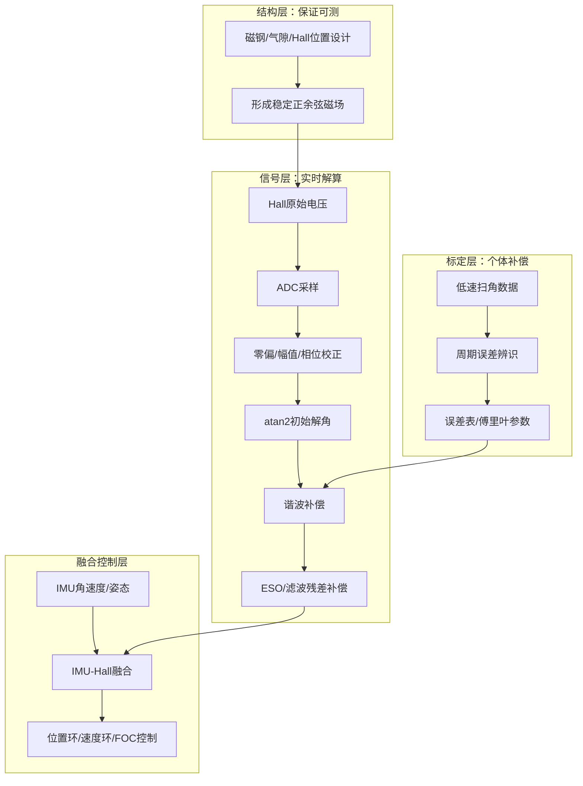

# 线性霍尔传感器高精度位置检测与补偿方法

本章基于当前文件夹中三篇近五年论文进行方法归纳：

- `02_Self_Calibrating_Position_Measurements_Imperfect_Hall_Sensors_2025.pdf`
- `03_TIE2021_Position_Extraction_Ultralow_Speed_Gimbal_Linear_Hall.pdf`
- `04_TMECH2022_3D_Printed_Halbach_Cylinder_Motor_Self_Position_Sensing.pdf`

三篇文章分别代表三类思路：数据驱动自校准、复合信号提取与观测器补偿、传感与电机结构一体化设计。考虑到项目成本、PCB 面积、线束数量和装配复杂度，本章后续工程方案统一限定为“每个旋转轴使用两颗线性霍尔传感器”。两路信号目标是形成近似正交的正弦/余弦关系，再通过标定和补偿提高位置检测精度。将三类思路结合后，可以形成适用于手持相机云台的“两路线性霍尔 + 高精度位置检测 + 误差补偿 + 闭环控制”的完整技术路线。

本章中的公式用于工程方案表达和后续仿真实现，并非逐字复刻论文推导。符号约定如下：

| 符号 | 含义 |
|---|---|
| `theta` | 机械角或待估计轴角 |
| `theta_e` | 电角度 |
| `d_h` | 第 h 路 Hall 原始测量信号 |
| `d_s,d_c` | 由两路 Hall 构造的正弦、余弦通道 |
| `V_h` | 第 h 路 Hall 电压 |
| `B_h` | 第 h 路 Hall 位置处磁感应强度 |
| `n_m` | 磁极对数或磁场周期数 |
| `v_h` | Hall 测量噪声 |
| `e(theta)` | 角度相关的周期性误差 |
| `hat` | 估计量或补偿后的量 |

## 1. 方法一：闭环自校准与数据驱动补偿方法

对应论文：`Self-Calibrating Position Measurements: Applied to Imperfect Hall Sensors`

### 1.1 方法背景

线性霍尔传感器可以替代高成本光电编码器，用于电机或执行器转子位置检测。但实际 Hall 信号并非理想正弦信号，主要误差来自：

- 磁钢充磁不均匀；
- 传感器安装偏差；
- 制造公差；
- 气隙变化；
- 多极磁场周期性误差；
- 高次谐波和非线性磁场分布。

这些误差会使 Hall 信号到真实位置之间的映射关系不再理想，直接用 `atan2` 解角会产生周期性位置误差，进而导致闭环控制中的速度波动、转矩波动和寄生振动。

### 1.2 核心思想

该方法不依赖昂贵外部编码器，而是利用电机闭环运行数据进行自校准。其核心是：

1. 通过 Hall 原始信号得到一个粗略位置估计；
2. 在闭环控制下采集 Hall 信号和控制输入；
3. 建立“转子位置 - Hall 磁通密度信号”的非线性模型；
4. 通过非线性辨识或仿真误差最小化识别 Hall 误差模型；
5. 在线运行时用该模型反向补偿 Hall 测量误差。

论文中采用三路线性 Hall 传感器，约相差 120 deg 电角度。对本项目而言，为降低成本和装配复杂度，不采用三路冗余结构，而是采用两路线性 Hall，安装目标为相差 90 deg 电角度。两路信号先经过零偏、幅值和相位校正，构造正弦/余弦通道，再利用 `atan2` 得到初始角度。随后仍可沿用论文的闭环自校准思想，利用运行数据识别更准确的磁场/误差函数。这样牺牲部分硬件冗余，但能保留主要补偿收益。

### 1.3 核心公式

Hall 原始测量可以抽象为转子位置的周期性非线性函数：

$$
d_h(k) = g_h(\theta(k)) + v_h(k), \quad h=1,2
$$

写成向量形式：

$$
\mathbf d(k)=
\begin{bmatrix}
d_1(k)\\d_2(k)
\end{bmatrix}
=
\mathbf g(\theta(k))+\mathbf v(k)
$$

在两霍尔方案中，先对两路原始信号做零偏和幅值归一化：

$$
\tilde d_1(k)=\frac{d_1(k)-o_1}{A_1},\qquad
\tilde d_2(k)=\frac{d_2(k)-o_2}{A_2}
$$

其中 `o_1,o_2` 为零偏，`A_1,A_2` 为幅值标定量。若两路信号存在相位误差 `delta_phi`，可用一阶正交化关系近似修正为：

$$
d_s(k)=\tilde d_1(k)
$$

$$
d_c(k)=
\frac{\tilde d_2(k)-\sin(\delta_\phi)\tilde d_1(k)}
{\cos(\delta_\phi)}
$$

初始角度估计为：

$$
\theta_{\mathrm{raw}}(k)
=
\frac{1}{n_m}
\operatorname{unwrap}
\left[
\operatorname{atan2}(d_s(k),d_c(k))
\right]
$$

实际误差可建模为周期函数，工程上常用傅里叶误差表：

$$
e(\theta)
= a_0+\sum_{n=1}^{N}
\left[
a_n\cos(n\theta)+b_n\sin(n\theta)
\right]
$$

补偿后的角度为：

$$
\hat{\theta}(k)
=
\theta_{\mathrm{raw}}(k)-\hat e(\theta_{\mathrm{raw}}(k))
$$

数据驱动辨识的目标可以写成：

$$
\hat{\eta}
=
\arg\min_{\eta}
\sum_{k}
\left\|
\mathbf d(k)-\hat{\mathbf g}_{\eta}(\hat{\theta}(k))
\right\|^2
$$

其中 `eta` 是磁场模型或误差表参数。论文中的重点在于：校准过程只依赖 Hall 测量和控制输入，不需要昂贵外部编码器作为长期标定工具。

### 1.4 方法流程框图

### 1.5 方法流程

工程实现可概括为：

1. 初始解角  
   采集两路 Hall 电压，进行零偏校正、幅值归一化和相位正交化，构造正弦/余弦通道并得到初始角度。

2. 闭环采集  
   让电机在安全闭环下按照低速扫角、往复运动或指定轨迹运行，同时记录 Hall 电压、控制输入、估计位置和时间戳。

3. 误差建模  
   将 Hall 信号看作转子位置的周期性非线性函数，用傅里叶基函数、查表模型、多项式模型或神经网络模型描述误差。

4. 参数辨识  
   通过最小化模型输出与实际采集数据之间的误差，识别模型参数。对于云台系统，建议优先使用低阶傅里叶模型和查表补偿，因为计算量可控，便于嵌入式实现。

5. 在线补偿  
   实时运行时，先用 Hall 信号得到粗略角度，再查表或计算补偿量，输出校正后的角度。

### 1.6 对云台项目的价值

该方法适合解决“批量装配后每台电机误差不同”的问题。手持相机云台中，磁钢、传感器和机械结构尺寸都较小，安装偏差和气隙变化不可避免，因此单纯依靠理论模型难以保证高精度。通过自校准，可以把每台电机的个体误差记录成补偿表，使低成本 Hall 传感器具备接近高精度位置反馈的能力。

## 2. 方法二：归一化 + 谐波重构 + 扩张状态观测器的复合信号提取方法

对应论文：`Position Extraction of Ultralow-Speed Gimbal Servo System With Linear Hall Sensors`

### 2.1 方法背景

该论文研究对象是超低速云台伺服系统中的线性 Hall 位置提取问题，与手持云台项目高度相关。实际 Hall 信号存在两个典型问题：

- 正弦和余弦两路信号幅值不一致；
- 信号中包含明显三次、五次、七次、九次等高次谐波。

如果直接使用原始 Hall 信号进行 `atan2` 解算，角度误差会较大，且低速条件下误差更容易表现为位置抖动。论文提出复合信号提取方法，将信号处理分成三层：信号归一化、谐波模型重构、离散扩张状态观测器补偿。

### 2.2 核心思想

该方法把 Hall 原始信号看成：

- 基波信号；
- 幅值不一致误差；
- 可建模的高次谐波；
- 未建模噪声和残余扰动。

处理思路是先把幅值问题消除，再把主要谐波通过模型抵消，最后用观测器估计残余扰动。其结构可以理解为：

`Hall 原始信号 -> 幅值归一化 -> 谐波重构/抵消 -> ESO 残差补偿 -> atan2 输出角度`

### 2.3 核心公式

两路线性 Hall 信号可近似表示为含奇次谐波的正余弦信号：

$$
H_s(k)
=
\alpha
\left[
\sin\theta(k)+\sum_{i\in\{3,5,7,9\}}A_i\sin(i\theta(k))
\right]
$$

$$
H_c(k)
=
\beta
\left[
\cos\theta(k)+\sum_{i\in\{3,5,7,9\}}B_i\cos(i\theta(k))
\right]
$$

其中 `alpha`、`beta` 表示两路信号幅值不一致，`A_i`、`B_i` 表示各阶谐波系数。

原始角度为：

$$
\theta_r(k)=\operatorname{atan2}\left(H_s(k),H_c(k)\right)
$$

幅值归一化后得到：

$$
H_{s1}(k)=\sin\theta_r(k), \qquad
H_{c1}(k)=\cos\theta_r(k)
$$

归一化后的信号仍含有高次谐波，可写为：

$$
H_{s1}(k)
=
\sin\theta(k)+\sum_{i\in\{3,5,7,9\}}C_i\sin(i\theta(k))
$$

$$
H_{c1}(k)
=
\cos\theta(k)+\sum_{i\in\{3,5,7,9\}}C_i\cos(i\theta(k))
$$

谐波重构利用多角公式，例如：

$$
\sin(3\theta)=3s-4s^3,\quad s=\sin\theta
$$

$$
\sin(5\theta)=5s-20s^3+16s^5
$$

因此可构造近似谐波项：

$$
\hat h_s(s)
=
\sum_{i\in\{3,5,7,9\}}
\hat C_i P_i(s)
$$

其中 `P_i(s)` 为由多角公式得到的 i 阶多项式。补偿后的正弦信号可表示为：

$$
H_{s2}(k)=H_{s1}(k)-\hat h_s(H_{s1}(k))
$$

余弦通道同理：

$$
H_{c2}(k)=H_{c1}(k)-\hat h_c(H_{c1}(k))
$$

对残余误差，引入离散 ESO。将重构后信号看作：

$$
u(k)=\sin\theta(k)+G(\theta(k))
$$

其中 `G(theta)` 表示未建模谐波、噪声和模型误差。ESO 可写为：

$$
e(k)=z_1(k)-y(k)
$$

$$
z_1(k+1)=z_1(k)+h\left[z_2(k)-\beta_1 e(k)+u(k)-z_1(k-1)\right]
$$

$$
z_2(k+1)=z_2(k)+h\left[-\beta_2 e(k)-z_2(k-1)\right]
$$

其中 `z_1` 估计理想基波信号，`z_2` 估计残余扰动。最终角度输出为：

$$
\hat{\theta}(k)
=
\operatorname{atan2}\left(z_{1s}(k),z_{1c}(k)\right)
$$

$$
\hat{\omega}(k)
=
\frac{\hat{\theta}(k)-\hat{\theta}(k-1)}{T_s}
$$

### 2.4 方法流程框图

### 2.5 方法流程

1. 原始信号建模  
   将两路 Hall 信号表示为含有基波和若干奇次谐波的正余弦信号。论文重点考虑三次、五次、七次、九次谐波。

2. 幅值归一化  
   对原始正余弦信号做归一化，使基波幅值统一为 1，减少幅值不一致对角度解算的影响。

3. 离线频谱分析  
   对采集到的 Hall 信号进行 FFT，识别主要谐波阶次和相对幅值。论文指出在其系统中，主要谐波比例在不同速度下基本稳定，因此可以离线识别谐波系数。

4. 信号重构  
   根据多角公式，把高次谐波表示成基波变量的函数，建立信号重构模型。重构模型用于抵消主要谐波，使输出信号更接近理想正余弦。

5. 离散 ESO 补偿  
   谐波模型不能完全覆盖所有噪声和建模误差，因此引入离散扩张状态观测器，把残余误差视为总扰动进行估计和补偿。

6. 角度输出  
   对最终补偿后的正余弦信号使用 `atan2`，得到角位置。论文实验中，原始位置误差约 0.18 rad，最终误差可压到约 0.011 rad 至 0.013 rad 范围，满足其云台伺服控制要求。

### 2.6 对云台项目的价值

该方法特别适合低速云台，因为低速时反电势弱、编码器成本高、Hall 信号误差又容易直接进入位置环。对本项目而言，可以把它作为实时信号处理主链路：

- 用归一化解决安装和磁场幅值差；
- 用 FFT 和谐波模型解决周期性角度误差；
- 用 ESO 解决未建模扰动和噪声；
- 最终输出给位置环、速度环或姿态融合模块。

该方法的优点是工程性强，计算量相对可控，适合 DSP、MCU 或 FPGA 实现。

## 3. 方法三：传感器与电机结构一体化的自位置检测方法

对应论文：`A 3-D Printed Halbach-Cylinder Motor With Self-Position Sensing for Precision Motions`

### 3.1 方法背景

前两种方法主要从信号处理和算法补偿角度提升 Hall 位置检测精度。第三种方法强调从电机结构和磁场设计源头提高可测性。论文设计了一种基于 Halbach 阵列的两相电机，通过结构设计形成较理想的磁场分布，并利用 Hall-effect sensors 实时测量转子位置。

该思路对特制微型电机和云台执行器很有价值，因为云台项目不仅要做算法，还要考虑电机、磁钢、传感器和机械结构的协同设计。

### 3.2 核心思想

该方法的核心不是“在已有电机上勉强补偿”，而是在电机设计阶段就让磁场分布和传感器布置更适合位置检测：

1. 通过 Halbach 磁体结构增强目标区域磁场；
2. 使传感器处的磁场变化更规律；
3. 在结构上预留 Hall 传感器测量位置；
4. 将 Hall 信号直接作为闭环位置反馈；
5. 用简单、可实现的闭环控制验证位置检测效果。

论文中的电机使用两路 Hall 传感器反馈位置，公开摘要中给出理论角分辨率约 0.16 deg，闭环定位最小步进约 0.32 deg，运动和速度跟踪误差小于 0.64 deg。

### 3.3 核心公式

线性 Hall 传感器输出电压可表示为：

$$
V_h(\theta)=V_{\mathrm{off},h}+S_h B_h(\theta)+n_h
$$

其中 `V_off,h` 为零偏，`S_h` 为灵敏度，`B_h(theta)` 为传感器位置处磁感应强度，`n_h` 为噪声。

若结构设计较理想，两个正交方向的磁场可近似为：

$$
B_x(\theta)=B_0\cos\theta+\varepsilon_x(\theta)
$$

$$
B_y(\theta)=B_0\sin\theta+\varepsilon_y(\theta)
$$

其中 `epsilon_x(theta)`、`epsilon_y(theta)` 表示磁场非理想、安装误差和结构误差引起的残差项。

经过零偏和增益校正：

$$
\tilde B_x
=
\frac{V_x-V_{\mathrm{off},x}}{S_x}
$$

$$
\tilde B_y
=
\frac{V_y-V_{\mathrm{off},y}}{S_y}
$$

轴角估计为：

$$
\hat{\theta}
=
\operatorname{atan2}(\tilde B_y,\tilde B_x)
$$

角度噪声可粗略估计为：

$$
\sigma_{\theta}
\approx
\frac{\sigma_B}{B_0}
$$

或用电压噪声表示为：

$$
\sigma_{\theta}
\approx
\frac{\sigma_V}{S B_0}
$$

因此，结构设计的目标很明确：增大有效磁场幅值 `B0`，降低噪声 `sigma_V`，并减小非理想项 `epsilon_x(theta)`、`epsilon_y(theta)`。

可将结构与传感器联合设计目标写成：

$$
\min_{\mathbf p}
J(\mathbf p)
=
w_1\operatorname{RMS}\left(e_{\theta}\right)
+w_2\operatorname{Ripple}\left(B\right)
+w_3\operatorname{Var}\left(gap\right)
$$

其中 `p` 表示磁钢尺寸、充磁方式、Hall 安装半径、气隙、PCB 位置等设计参数；`e_theta` 为解角误差；`Ripple(B)` 为磁场波动；`Var(gap)` 为气隙变化。

### 3.4 方法流程框图

### 3.5 方法流程

1. 磁路设计  
   在电机或云台轴系中布置永磁体，使传感器附近磁场具有稳定、可重复、单调或正余弦变化特征。

2. 传感器布局  
   根据磁场分布决定两颗 Hall 传感器的安装半径、夹角、气隙和方向。对旋转角检测，优先形成相差 90 deg 的正余弦信号，不再增加第三路冗余传感器。

3. 结构集成  
   将传感器固定在刚性结构上，减少装配松动和气隙变化。对微型云台，可将 Hall 芯片直接布置在定子 PCB 上，磁钢安装在转子或轴端。

4. 初始标定  
   通过低速旋转采集一圈或多圈 Hall 数据，建立角度映射表，验证是否存在重复性、死区、跳变和饱和。

5. 闭环控制  
   将 Hall 解算角度作为位置环反馈，必要时与陀螺仪角速度进行互补滤波或卡尔曼融合。

### 3.6 对云台项目的价值

该方法适合指导特制电机阶段的传感结构设计。若仅在成品电机上增加 Hall 传感器，信号质量可能受限；如果在电机设计阶段同步优化磁钢、气隙、传感器位置和 PCB 布局，则后续算法补偿压力会显著下降。对于多自由度云台，结构一体化设计还能减少体积、线束和装配误差。

## 4. 三种方法的综合技术路线

三篇论文可以组合成一个完整方案：

1. 方法三负责“结构可测”  
   在电机和云台结构设计阶段，使磁场分布适合 Hall 传感器检测，保证原始信号有足够幅值、重复性和相位关系。

2. 方法二负责“实时解算”  
   在控制器中实时完成归一化、谐波重构、ESO 残差补偿和 `atan2` 解角，得到低延迟角度反馈。

3. 方法一负责“个体标定”  
   对每台电机进行闭环自校准，形成补偿参数或查表数据，用来修正制造与装配差异。

因此，建议本项目采用如下总体链路：

`线性 Hall 原始电压 -> ADC 采样 -> 零偏与幅值归一化 -> 正余弦解算 -> 谐波模型补偿 -> 自校准误差表补偿 -> ESO/滤波抑制残差 -> 输出高精度角度 -> 与 IMU 互补融合 -> 位置/速度/电流闭环控制`

总体融合框图如下：

对应工程公式可写为：

$$
\hat{\theta}_{\mathrm{Hall}}
=
\operatorname{Comp}_{\mathrm{ESO}}
\left[
\operatorname{Comp}_{\mathrm{harm}}
\left(
\operatorname{atan2}(\tilde H_s,\tilde H_c)
\right)
\right]
$$

$$
\hat{\theta}_{\mathrm{axis}}
=
\hat{\theta}_{\mathrm{Hall}}
-
\hat e_{\mathrm{cal}}(\hat{\theta}_{\mathrm{Hall}})
$$

其中 `Comp_harm` 表示谐波补偿，`Comp_ESO` 表示残差扰动估计，`e_cal` 表示个体自校准误差表。

## 5. 面向手持相机云台的实现建议

### 5.1 硬件层

- 每个旋转轴固定采用两颗线性 Hall 传感器，目标是形成正余弦关系。
- 不配置第三路 Hall 冗余通道；故障诊断主要依赖两路信号幅值、相位、一致性残差以及 IMU/电机模型交叉校验。
- Hall 芯片尽量靠近磁钢有效磁场区域，但避免饱和。
- PCB 和磁钢安装结构应保证气隙稳定，减少装配后偏心。
- 对特制电机，应在磁钢充磁和 Hall 安装位置设计阶段同步仿真磁场。

### 5.2 标定层

- 出厂或实验阶段，让电机低速扫过完整角度范围。
- 记录 Hall 原始值、解算角度、IMU 或外部参考角度。
- 建立零偏、幅值、相位、谐波和周期误差补偿参数。
- 对每台电机保存独立标定参数，避免把单台样机参数直接用于所有样机。

### 5.3 实时算法层

- 快速路径：零偏校正、幅值归一化、`atan2` 解角。
- 精度路径：谐波补偿、查表补偿、ESO 或低延迟滤波。
- 融合路径：Hall 角度用于低漂移位置反馈，陀螺仪用于高带宽角速度反馈，两者通过互补滤波或扩展卡尔曼滤波融合。

### 5.4 控制层

- 内环仍采用电流环，保证力矩响应。
- 中间层采用速度环，抑制负载扰动和手持抖动。
- 外层采用位置环或姿态环，实现目标角度保持和大角度运动控制。
- Hall 角度主要服务于位置环和速度估计，IMU 主要服务于姿态稳定和抗手抖。

## 6. 可行性结论

结合三篇文章可以得到结论：线性 Hall 传感器具备应用于手持相机云台高精度位置检测的可行性，但不能只依赖原始 Hall 信号直接解角。可靠方案应同时包含结构设计、信号处理、误差标定和传感融合四个层次。

对本项目最推荐的技术路线是：

- 结构上，采用磁钢与 Hall 传感器一体化设计，保证原始信号质量；
- 算法上，采用归一化、谐波补偿和 ESO 抑制实时误差；
- 标定上，采用闭环自校准或查表补偿修正个体差异；
- 控制上，将 Hall 与 IMU 融合，为多轴云台提供低漂移、高带宽的位置与姿态反馈。

该路线兼顾成本、体积、可制造性和控制精度，适合作为后续特制微型无刷电机及多自由度级联云台控制方案的传感器检测基础。

## 参考资料

1. Max van Meer et al., Self-Calibrating Position Measurements: Applied to Imperfect Hall Sensors, IFAC-PapersOnLine, 2025.
2. Yangyang Shi, Haitao Li, Bangcheng Han, Position Extraction of Ultralow-Speed Gimbal Servo System With Linear Hall Sensors, IEEE Transactions on Industrial Electronics, 2021/2022.
3. Yuan Wei, Vu Huy Nguyen, Won-Jong Kim, A 3-D Printed Halbach-Cylinder Motor With Self-Position Sensing for Precision Motions, IEEE/ASME Transactions on Mechatronics, 2022.

